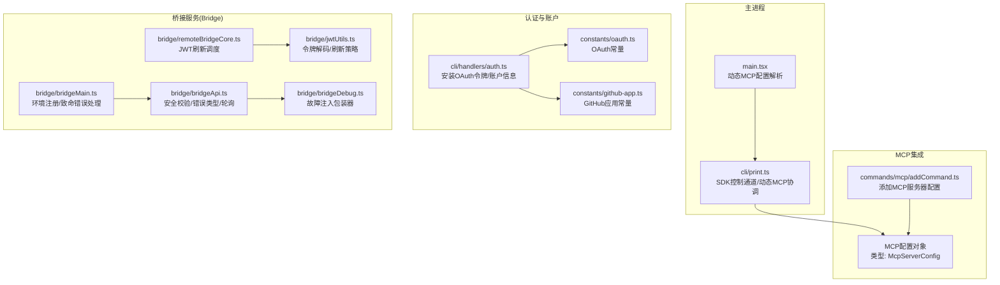
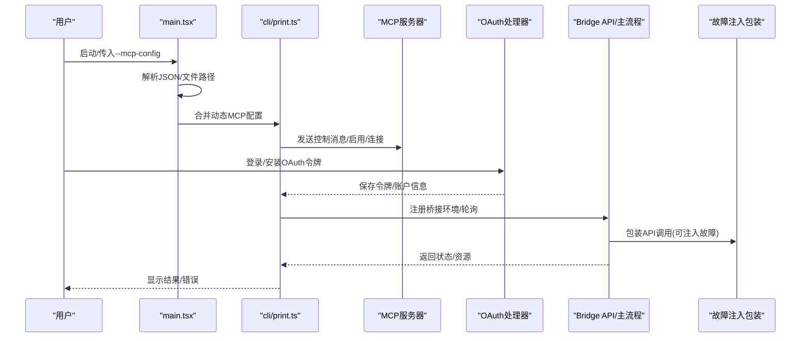
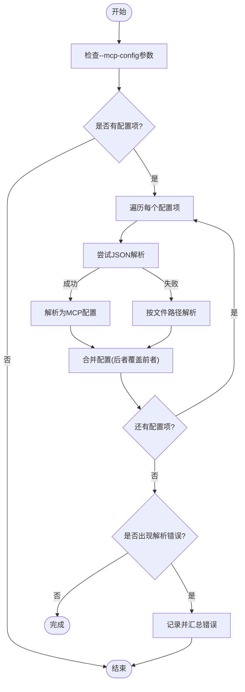
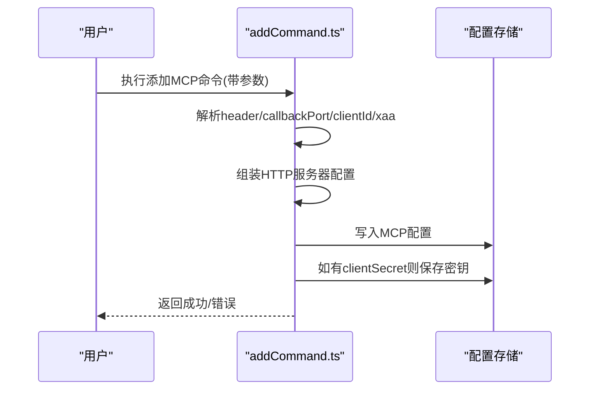
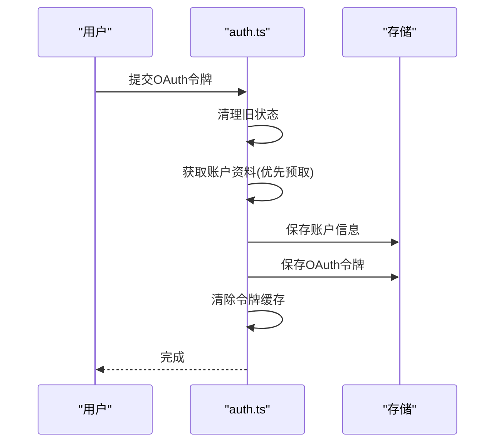
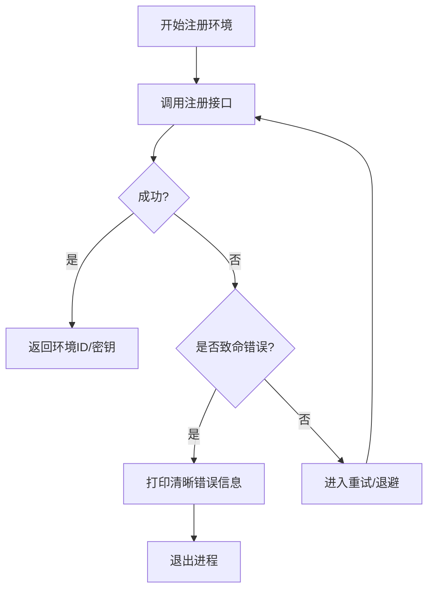
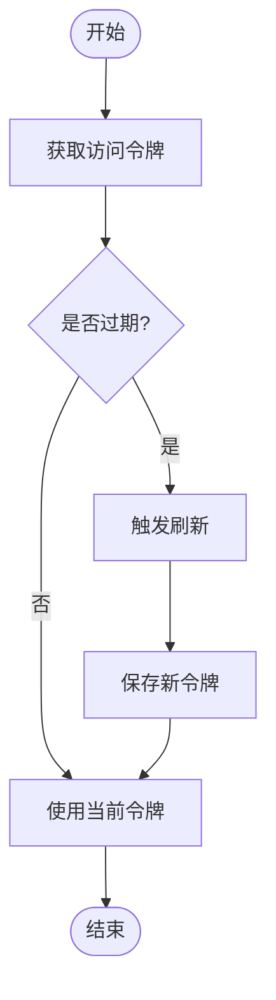
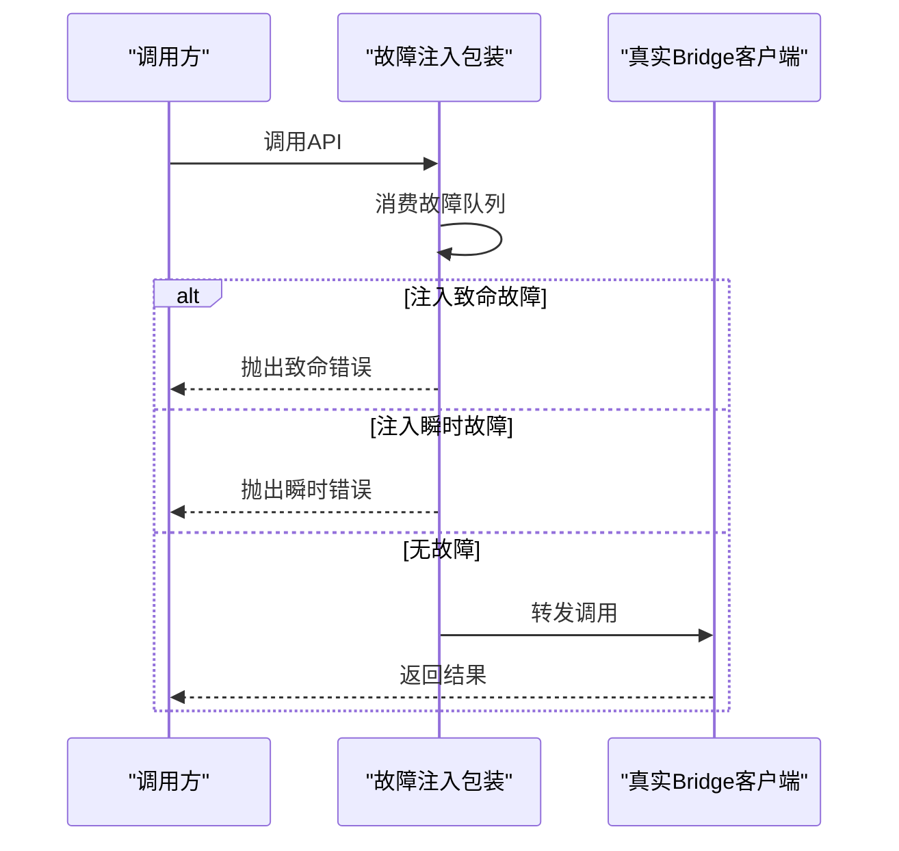
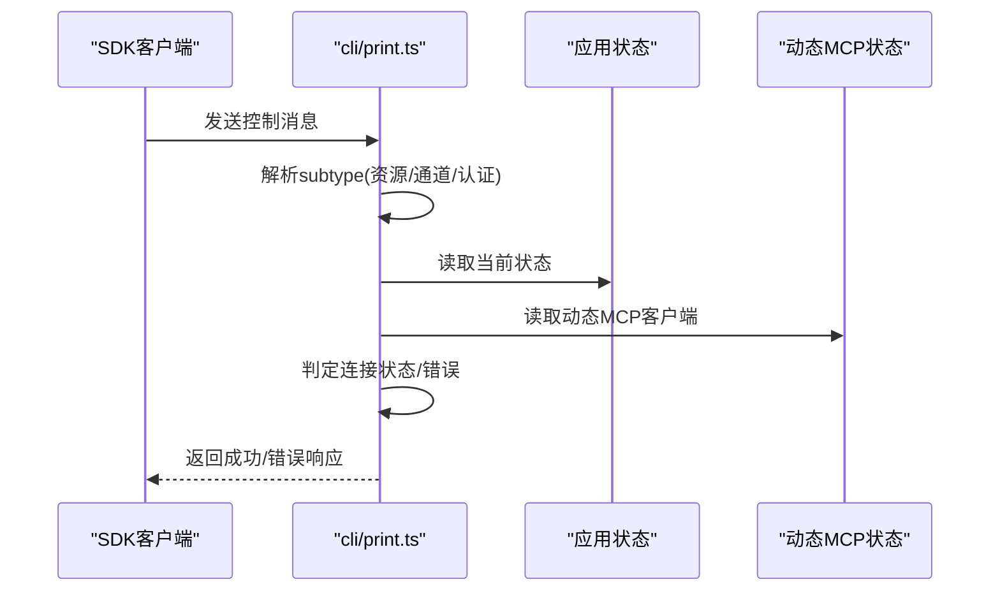
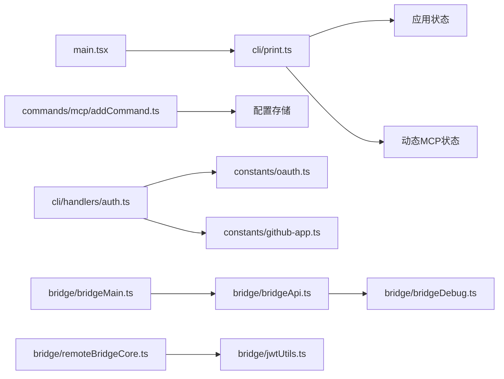

# 集成服务设置

<cite>
**本文引用的文件**
- [src/main.tsx](file://src/main.tsx)
- [src/commands/mcp/addCommand.ts](file://src/commands/mcp/addCommand.ts)
- [src/cli/handlers/auth.ts](file://src/cli/handlers/auth.ts)
- [src/bridge/bridgeApi.ts](file://src/bridge/bridgeApi.ts)
- [src/bridge/bridgeMain.ts](file://src/bridge/bridgeMain.ts)
- [src/bridge/remoteBridgeCore.ts](file://src/bridge/remoteBridgeCore.ts)
- [src/bridge/jwtUtils.ts](file://src/bridge/jwtUtils.ts)
- [src/bridge/bridgeDebug.ts](file://src/bridge/bridgeDebug.ts)
- [src/cli/print.ts](file://src/cli/print.ts)
- [src/constants/oauth.ts](file://src/constants/oauth.ts)
- [src/constants/github-app.ts](file://src/constants/github-app.ts)
</cite>

## 目录
1. [简介](#简介)
2. [项目结构](#项目结构)
3. [核心组件](#核心组件)
4. [架构总览](#架构总览)
5. [详细组件分析](#详细组件分析)
6. [依赖关系分析](#依赖关系分析)
7. [性能考虑](#性能考虑)
8. [故障排查指南](#故障排查指南)
9. [结论](#结论)
10. [附录](#附录)

## 简介
本文件系统性梳理“集成服务设置”，聚焦第三方服务集成与配置，涵盖以下主题：
- 第三方服务集成配置：GitHub 应用、OAuth 认证、MCP（Model Context Protocol）服务器等
- 认证配置、连接参数、同步设置等集成相关设置
- 服务发现、自动配置与故障注入/恢复机制
- 常见集成场景的配置示例与最佳实践
- 集成服务的健康检查与监控建议

## 项目结构
围绕集成服务的关键目录与文件：
- 主入口与动态 MCP 配置解析：src/main.tsx
- MCP 添加命令与配置持久化：src/commands/mcp/addCommand.ts
- OAuth 安装与账户信息存储：src/cli/handlers/auth.ts
- 桥接服务（Bridge）API、注册与重试策略：src/bridge/bridgeApi.ts、src/bridge/bridgeMain.ts
- 远程桥接核心与令牌刷新调度：src/bridge/remoteBridgeCore.ts、src/bridge/jwtUtils.ts
- 故障注入与调试：src/bridge/bridgeDebug.ts
- CLI 控制通道与动态 MCP 服务器协调：src/cli/print.ts
- OAuth/GitHub 常量定义：src/constants/oauth.ts、src/constants/github-app.ts

图表来源
- [src/main.tsx:1419-1470](file://src/main.tsx#L1419-L1470)
- [src/cli/print.ts:3281-3310](file://src/cli/print.ts#L3281-L3310)
- [src/commands/mcp/addCommand.ts:198-229](file://src/commands/mcp/addCommand.ts#L198-L229)
- [src/cli/handlers/auth.ts:46-80](file://src/cli/handlers/auth.ts#L46-L80)
- [src/bridge/bridgeApi.ts:38-74](file://src/bridge/bridgeApi.ts#L38-L74)
- [src/bridge/bridgeMain.ts:2447-2467](file://src/bridge/bridgeMain.ts#L2447-L2467)
- [src/bridge/remoteBridgeCore.ts:311-332](file://src/bridge/remoteBridgeCore.ts#L311-L332)
- [src/bridge/jwtUtils.ts:34-183](file://src/bridge/jwtUtils.ts#L34-L183)
- [src/bridge/bridgeDebug.ts:77-110](file://src/bridge/bridgeDebug.ts#L77-L110)

章节来源
- [src/main.tsx:1419-1470](file://src/main.tsx#L1419-L1470)
- [src/cli/print.ts:3281-3310](file://src/cli/print.ts#L3281-L3310)
- [src/commands/mcp/addCommand.ts:198-229](file://src/commands/mcp/addCommand.ts#L198-L229)
- [src/cli/handlers/auth.ts:46-80](file://src/cli/handlers/auth.ts#L46-L80)
- [src/bridge/bridgeApi.ts:38-74](file://src/bridge/bridgeApi.ts#L38-L74)
- [src/bridge/bridgeMain.ts:2447-2467](file://src/bridge/bridgeMain.ts#L2447-L2467)
- [src/bridge/remoteBridgeCore.ts:311-332](file://src/bridge/remoteBridgeCore.ts#L311-L332)
- [src/bridge/jwtUtils.ts:34-183](file://src/bridge/jwtUtils.ts#L34-L183)
- [src/bridge/bridgeDebug.ts:77-110](file://src/bridge/bridgeDebug.ts#L77-L110)

## 核心组件
- 动态 MCP 配置解析与合并：支持从命令行传入 JSON 字符串或文件路径，解析为内部配置对象，并进行覆盖合并。
- MCP 服务器添加与持久化：支持通过命令添加 HTTP 类型的 MCP 服务器，可选配置头、回调端口、OAuth 参数以及客户端密钥。
- OAuth 安装与账户信息：安装 OAuth 令牌后保存账户信息、角色与配置，清理旧状态并建立本地认证状态。
- 桥接服务 API：提供安全校验、错误类型（含致命错误）、轮询与空轮询计数等能力；桥接主流程负责环境注册与致命错误处理。
- 远程桥接核心与令牌刷新：在 JWT 过期前触发刷新，避免心跳与 epoch 不一致导致的冲突；提供刷新失败上限与重试策略。
- 故障注入与调试：在特定用户类型下对桥接 API 调用进行故障注入包装，便于测试瞬时/致命错误场景。
- CLI 控制通道：处理 SDK 控制消息，协调动态 MCP 服务器的启用、连接状态与资源清单更新。

章节来源
- [src/main.tsx:1419-1470](file://src/main.tsx#L1419-L1470)
- [src/commands/mcp/addCommand.ts:198-229](file://src/commands/mcp/addCommand.ts#L198-L229)
- [src/cli/handlers/auth.ts:46-80](file://src/cli/handlers/auth.ts#L46-L80)
- [src/bridge/bridgeApi.ts:38-74](file://src/bridge/bridgeApi.ts#L38-L74)
- [src/bridge/bridgeMain.ts:2447-2467](file://src/bridge/bridgeMain.ts#L2447-L2467)
- [src/bridge/remoteBridgeCore.ts:311-332](file://src/bridge/remoteBridgeCore.ts#L311-L332)
- [src/bridge/jwtUtils.ts:34-183](file://src/bridge/jwtUtils.ts#L34-L183)
- [src/bridge/bridgeDebug.ts:77-110](file://src/bridge/bridgeDebug.ts#L77-L110)
- [src/cli/print.ts:3281-3310](file://src/cli/print.ts#L3281-L3310)

## 架构总览
下图展示从主进程到桥接服务与 MCP 的整体交互，以及认证与故障注入路径：

图表来源
- [src/main.tsx:1419-1470](file://src/main.tsx#L1419-L1470)
- [src/cli/print.ts:3281-3310](file://src/cli/print.ts#L3281-L3310)
- [src/cli/handlers/auth.ts:46-80](file://src/cli/handlers/auth.ts#L46-L80)
- [src/bridge/bridgeApi.ts:38-74](file://src/bridge/bridgeApi.ts#L38-L74)
- [src/bridge/bridgeMain.ts:2447-2467](file://src/bridge/bridgeMain.ts#L2447-L2467)
- [src/bridge/bridgeDebug.ts:77-110](file://src/bridge/bridgeDebug.ts#L77-L110)

## 详细组件分析

### 动态 MCP 配置解析与合并
- 支持从命令行传入多个配置项，优先尝试作为 JSON 字符串解析，否则按文件路径解析
- 将解析得到的 MCP 服务器配置进行合并，后者覆盖前者
- 若解析出现错误，记录并汇总所有错误信息

图表来源
- [src/main.tsx:1419-1470](file://src/main.tsx#L1419-L1470)

章节来源
- [src/main.tsx:1419-1470](file://src/main.tsx#L1419-L1470)

### MCP 服务器添加与持久化
- 支持添加 HTTP 类型的 MCP 服务器，可配置请求头、OAuth 参数（clientId、callbackPort、xaa）
- 可选保存客户端密钥，用于后续认证
- 将配置写入持久化存储并根据需要保存客户端密钥

图表来源
- [src/commands/mcp/addCommand.ts:198-229](file://src/commands/mcp/addCommand.ts#L198-L229)

章节来源
- [src/commands/mcp/addCommand.ts:198-229](file://src/commands/mcp/addCommand.ts#L198-L229)

### OAuth 安装与账户信息
- 安装 OAuth 令牌后清理旧状态，获取并保存账户信息（UUID、邮箱、组织等）
- 优先使用已预取的资料，若不可用则回退到令牌交换数据
- 保存令牌并清除缓存

图表来源
- [src/cli/handlers/auth.ts:46-80](file://src/cli/handlers/auth.ts#L46-L80)

章节来源
- [src/cli/handlers/auth.ts:46-80](file://src/cli/handlers/auth.ts#L46-L80)

### 桥接服务 API、注册与重试
- 提供安全校验函数与致命错误类型，确保 URL 路径段 ID 的安全性
- 在注册阶段捕获致命错误并输出清晰提示，非致命错误进入重试逻辑
- 空轮询计数与日志间隔控制，避免噪音

图表来源
- [src/bridge/bridgeApi.ts:38-74](file://src/bridge/bridgeApi.ts#L38-L74)
- [src/bridge/bridgeMain.ts:2447-2467](file://src/bridge/bridgeMain.ts#L2447-L2467)

章节来源
- [src/bridge/bridgeApi.ts:38-74](file://src/bridge/bridgeApi.ts#L38-L74)
- [src/bridge/bridgeMain.ts:2447-2467](file://src/bridge/bridgeMain.ts#L2447-L2467)

### 远程桥接核心与令牌刷新
- 在 JWT 过期前一定时间触发刷新，避免仅更换 JWT 导致的心跳与 epoch 不一致
- 刷新失败达到上限后停止，防止无限循环
- 提供刷新重试延迟与生成号一致性检查，避免过期任务继续执行

图表来源
- [src/bridge/remoteBridgeCore.ts:311-332](file://src/bridge/remoteBridgeCore.ts#L311-L332)
- [src/bridge/jwtUtils.ts:34-183](file://src/bridge/jwtUtils.ts#L34-L183)

章节来源
- [src/bridge/remoteBridgeCore.ts:311-332](file://src/bridge/remoteBridgeCore.ts#L311-L332)
- [src/bridge/jwtUtils.ts:34-183](file://src/bridge/jwtUtils.ts#L34-L183)

### 故障注入与调试
- 在特定用户类型下，对桥接 API 调用进行包装，按队列注入致命或瞬时故障
- 支持计数与上下文日志，便于定位问题

图表来源
- [src/bridge/bridgeDebug.ts:77-110](file://src/bridge/bridgeDebug.ts#L77-L110)

章节来源
- [src/bridge/bridgeDebug.ts:77-110](file://src/bridge/bridgeDebug.ts#L77-L110)

### CLI 控制通道与动态 MCP 协调
- 处理 SDK 控制消息，包括资源清单更新、通道启用、认证请求等
- 对连接状态进行判定并反馈错误或成功
- 协调多源客户端（应用状态、SDK、动态MCP）以统一通道启用

图表来源
- [src/cli/print.ts:3281-3310](file://src/cli/print.ts#L3281-L3310)

章节来源
- [src/cli/print.ts:3281-3310](file://src/cli/print.ts#L3281-L3310)

## 依赖关系分析
- 主入口依赖 CLI 控制通道与动态 MCP 配置解析
- MCP 添加命令依赖配置存储与可选客户端密钥保存
- OAuth 安装依赖常量与账户信息存储
- 桥接服务依赖远程桥接核心与 JWT 工具，调试模块包装 API 调用
- CLI 控制通道依赖应用状态与动态 MCP 状态进行协调

图表来源
- [src/main.tsx:1419-1470](file://src/main.tsx#L1419-L1470)
- [src/cli/print.ts:3281-3310](file://src/cli/print.ts#L3281-L3310)
- [src/commands/mcp/addCommand.ts:198-229](file://src/commands/mcp/addCommand.ts#L198-L229)
- [src/cli/handlers/auth.ts:46-80](file://src/cli/handlers/auth.ts#L46-L80)
- [src/bridge/bridgeApi.ts:38-74](file://src/bridge/bridgeApi.ts#L38-L74)
- [src/bridge/bridgeMain.ts:2447-2467](file://src/bridge/bridgeMain.ts#L2447-L2467)
- [src/bridge/remoteBridgeCore.ts:311-332](file://src/bridge/remoteBridgeCore.ts#L311-L332)
- [src/bridge/jwtUtils.ts:34-183](file://src/bridge/jwtUtils.ts#L34-L183)
- [src/bridge/bridgeDebug.ts:77-110](file://src/bridge/bridgeDebug.ts#L77-L110)

章节来源
- [src/main.tsx:1419-1470](file://src/main.tsx#L1419-L1470)
- [src/cli/print.ts:3281-3310](file://src/cli/print.ts#L3281-L3310)
- [src/commands/mcp/addCommand.ts:198-229](file://src/commands/mcp/addCommand.ts#L198-L229)
- [src/cli/handlers/auth.ts:46-80](file://src/cli/handlers/auth.ts#L46-L80)
- [src/bridge/bridgeApi.ts:38-74](file://src/bridge/bridgeApi.ts#L38-L74)
- [src/bridge/bridgeMain.ts:2447-2467](file://src/bridge/bridgeMain.ts#L2447-L2467)
- [src/bridge/remoteBridgeCore.ts:311-332](file://src/bridge/remoteBridgeCore.ts#L311-L332)
- [src/bridge/jwtUtils.ts:34-183](file://src/bridge/jwtUtils.ts#L34-L183)
- [src/bridge/bridgeDebug.ts:77-110](file://src/bridge/bridgeDebug.ts#L77-L110)

## 性能考虑
- 动态 MCP 配置解析采用线性扫描与合并，复杂度 O(N+M)，N 为配置项数量，M 为最终配置键数
- 桥接轮询与空轮询计数控制可减少无效请求频率，降低网络与 CPU 开销
- 令牌刷新在过期前触发，避免频繁 401 导致的抖动与重试风暴
- 故障注入仅在特定构建类型启用，避免对生产性能造成影响

## 故障排查指南
- 桥接注册失败
  - 现象：注册阶段抛出致命错误或返回 404
  - 排查：确认账户权限、网络连通性与服务可用性；查看桥接 API 的错误类型与状态码
  - 参考
    - [src/bridge/bridgeMain.ts:2447-2467](file://src/bridge/bridgeMain.ts#L2447-L2467)
    - [src/bridge/bridgeApi.ts:38-74](file://src/bridge/bridgeApi.ts#L38-L74)
- OAuth 安装异常
  - 现象：无法保存令牌或账户信息缺失
  - 排查：检查令牌有效性、预取资料可用性与存储写入权限
  - 参考
    - [src/cli/handlers/auth.ts:46-80](file://src/cli/handlers/auth.ts#L46-L80)
- MCP 连接失败
  - 现象：通道启用或连接状态为失败
  - 排查：核对服务器地址、请求头、OAuth 参数与客户端密钥；查看控制通道返回的错误信息
  - 参考
    - [src/cli/print.ts:3281-3310](file://src/cli/print.ts#L3281-L3310)
    - [src/commands/mcp/addCommand.ts:198-229](file://src/commands/mcp/addCommand.ts#L198-L229)
- 令牌刷新失败
  - 现象：连续刷新失败或心跳异常
  - 排查：检查访问令牌来源、过期时间与刷新缓冲；确认刷新上限与重试延迟配置
  - 参考
    - [src/bridge/jwtUtils.ts:34-183](file://src/bridge/jwtUtils.ts#L34-L183)
    - [src/bridge/remoteBridgeCore.ts:311-332](file://src/bridge/remoteBridgeCore.ts#L311-L332)
- 故障注入验证
  - 现象：API 调用被注入致命或瞬时错误
  - 排查：确认调试模式与故障队列配置；检查日志中的注入上下文
  - 参考
    - [src/bridge/bridgeDebug.ts:77-110](file://src/bridge/bridgeDebug.ts#L77-L110)

章节来源
- [src/bridge/bridgeMain.ts:2447-2467](file://src/bridge/bridgeMain.ts#L2447-L2467)
- [src/bridge/bridgeApi.ts:38-74](file://src/bridge/bridgeApi.ts#L38-L74)
- [src/cli/handlers/auth.ts:46-80](file://src/cli/handlers/auth.ts#L46-L80)
- [src/cli/print.ts:3281-3310](file://src/cli/print.ts#L3281-L3310)
- [src/commands/mcp/addCommand.ts:198-229](file://src/commands/mcp/addCommand.ts#L198-L229)
- [src/bridge/jwtUtils.ts:34-183](file://src/bridge/jwtUtils.ts#L34-L183)
- [src/bridge/remoteBridgeCore.ts:311-332](file://src/bridge/remoteBridgeCore.ts#L311-L332)
- [src/bridge/bridgeDebug.ts:77-110](file://src/bridge/bridgeDebug.ts#L77-L110)

## 结论
本文档从架构与实现层面梳理了集成服务设置的关键路径：动态 MCP 配置解析、MCP 服务器添加、OAuth 安装、桥接服务注册与令牌刷新、以及故障注入与调试。结合常见场景的最佳实践与排障建议，可帮助用户稳定地完成第三方服务集成与运维。

## 附录
- 常见集成场景与最佳实践
  - GitHub 应用集成：通过常量与账户信息存储配合 OAuth 流程，确保应用权限与组织绑定正确
  - OAuth 认证：优先使用预取资料，失败时回退到令牌交换数据；定期刷新令牌并设置合理缓冲
  - MCP 服务器：使用 HTTP 类型配置，明确请求头与回调端口；必要时配置客户端密钥并妥善保管
  - 桥接服务：关注注册阶段的致命错误与重试策略；在开发阶段启用故障注入以验证恢复链路
- 健康检查与监控建议
  - 桥接服务：监控注册成功率、轮询空次数与 401 触发频率
  - OAuth：监控令牌刷新成功率与失败重试次数
  - MCP：监控通道启用与连接状态变化、资源清单更新频率
  - 故障注入：在受控环境中验证瞬时/致命错误的恢复行为