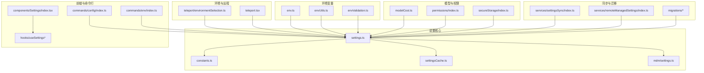
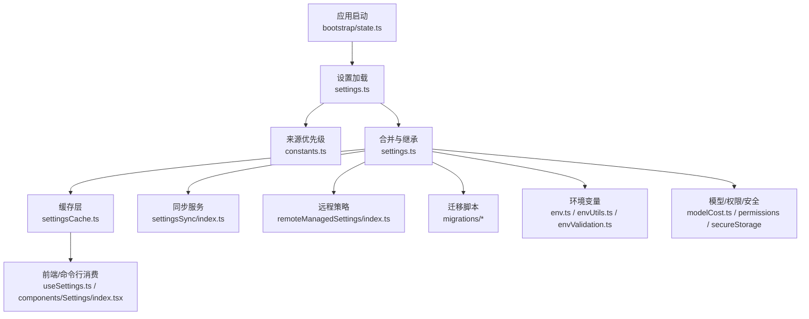
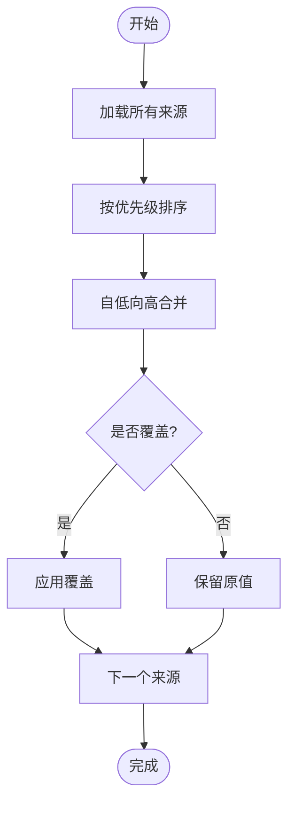
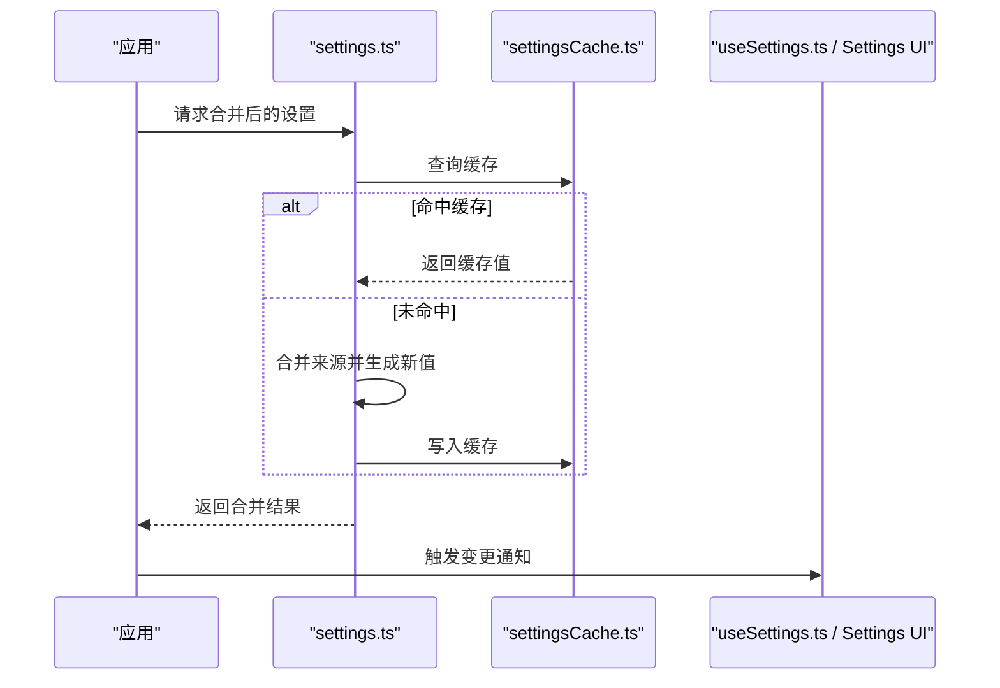
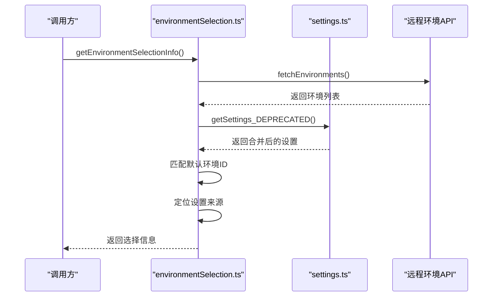
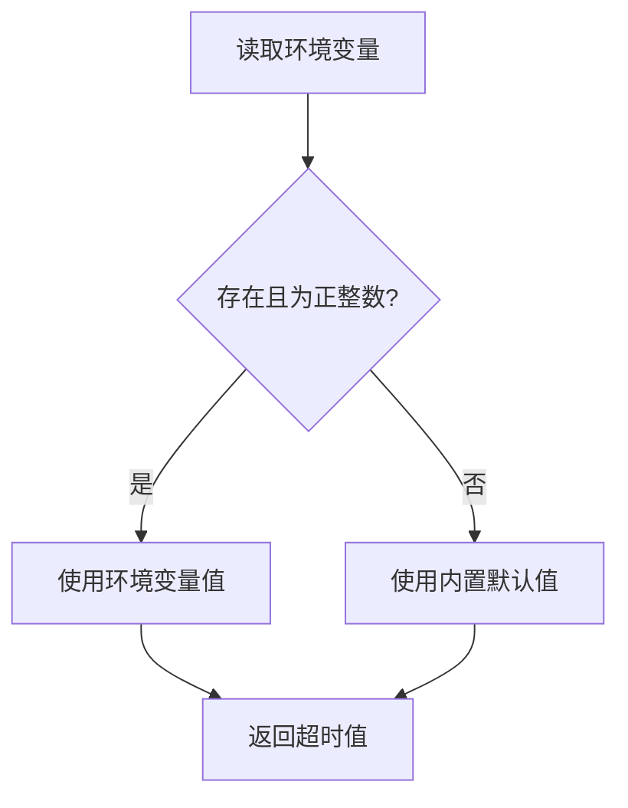
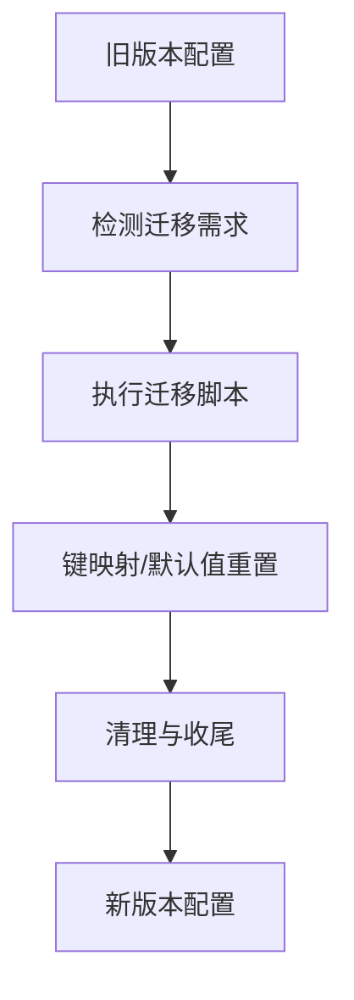
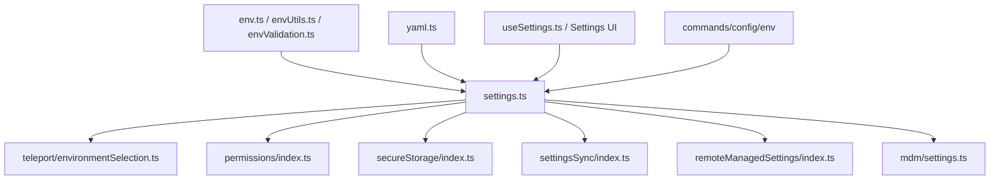

# 配置与设置

<cite>
**本文引用的文件**
- [src/utils/settings/settings.ts](file://src/utils/settings/settings.ts)
- [src/utils/settings/constants.ts](file://src/utils/settings/constants.ts)
- [src/utils/settings/settingsCache.ts](file://src/utils/settings/settingsCache.ts)
- [src/utils/settings/mdm/settings.ts](file://src/utils/settings/mdm/settings.ts)
- [src/utils/teleport/environmentSelection.ts](file://src/utils/teleport/environmentSelection.ts)
- [src/utils/teleport.tsx](file://src/utils/teleport.tsx)
- [src/utils/timeout.ts](file://src/utils/timeout.ts)
- [src/utils/yaml.ts](file://src/utils/yaml.ts)
- [src/utils/worktree.ts](file://src/utils/worktree.ts)
- [src/utils/env.ts](file://src/utils/env.ts)
- [src/utils/envUtils.ts](file://src/utils/envUtils.ts)
- [src/utils/envValidation.ts](file://src/utils/envValidation.ts)
- [src/utils/gitSettings.ts](file://src/utils/gitSettings.ts)
- [src/utils/model/modelCost.ts](file://src/utils/model/modelCost.ts)
- [src/utils/permissions/index.ts](file://src/utils/permissions/index.ts)
- [src/utils/secureStorage/index.ts](file://src/utils/secureStorage/index.ts)
- [src/services/settingsSync/index.ts](file://src/services/settingsSync/index.ts)
- [src/services/remoteManagedSettings/index.ts](file://src/services/remoteManagedSettings/index.ts)
- [src/hooks/useSettings.ts](file://src/hooks/useSettings.ts)
- [src/hooks/useSettingsChange.ts](file://src/hooks/useSettingsChange.ts)
- [src/components/Settings/index.tsx](file://src/components/Settings/index.tsx)
- [src/commands/config/index.ts](file://src/commands/config/index.ts)
- [src/commands/env/index.ts](file://src/commands/env/index.ts)
- [src/commands/privacy-settings/index.ts](file://src/commands/privacy-settings/index.ts)
- [src/migrations/migrateAutoUpdatesToSettings.ts](file://src/migrations/migrateAutoUpdatesToSettings.ts)
- [src/migrations/migrateBypassPermissionsAcceptedToSettings.ts](file://src/migrations/migrateBypassPermissionsAcceptedToSettings.ts)
- [src/migrations/migrateEnableAllProjectMcpServersToSettings.ts](file://src/migrations/migrateEnableAllProjectMcpServersToSettings.ts)
- [src/migrations/migrateFennecToOpus.ts](file://src/migrations/migrateFennecToOpus.ts)
- [src/migrations/migrateLegacyOpusToCurrent.ts](file://src/migrations/migrateLegacyOpusToCurrent.ts)
- [src/migrations/migrateOpusToOpus1m.ts](file://src/migrations/migrateOpusToOpus1m.ts)
- [src/migrations/migrateReplBridgeEnabledToRemoteControlAtStartup.ts](file://src/migrations/migrateReplBridgeEnabledToRemoteControlAtStartup.ts)
- [src/migrations/migrateSonnet1mToSonnet45.ts](file://src/migrations/migrateSonnet1mToSonnet45.ts)
- [src/migrations/migrateSonnet45ToSonnet46.ts](file://src/migrations/migrateSonnet45ToSonnet46.ts)
- [src/migrations/resetAutoModeOptInForDefaultOffer.ts](file://src/migrations/resetAutoModeOptInForDefaultOffer.ts)
- [src/migrations/resetProToOpusDefault.ts](file://src/migrations/resetProToOpusDefault.ts)
- [src/bootstrap/state.ts](file://src/bootstrap/state.ts)
- [src/state/AppState.tsx](file://src/state/AppState.tsx)
- [src/state/AppStateStore.ts](file://src/state/AppStateStore.ts)
- [src/cli/update.ts](file://src/cli/update.ts)
- [src/cli/print.ts](file://src/cli/print.ts)
- [src/entrypoints/sdk/settingsTypes.generated.ts](file://src/entrypoints/sdk/settingsTypes.generated.ts)
</cite>

## 目录
1. [简介](#简介)
2. [项目结构](#项目结构)
3. [核心组件](#核心组件)
4. [架构总览](#架构总览)
5. [详细组件分析](#详细组件分析)
6. [依赖关系分析](#依赖关系分析)
7. [性能考量](#性能考量)
8. [故障排除指南](#故障排除指南)
9. [结论](#结论)
10. [附录](#附录)

## 简介
本文件系统性梳理 Claude Code 的配置与设置体系，覆盖配置文件格式、优先级与继承机制、设置项功能与影响（模型、权限、界面等）、本地与云端同步、配置迁移、最佳实践、安全与故障排除，以及环境变量与批量设置管理。内容基于仓库中实际实现进行归纳总结，帮助开发者与用户理解并正确使用配置系统。

## 项目结构
配置与设置相关的关键目录与文件：
- 设置核心与常量：src/utils/settings/*
- MDM（移动设备管理）设置：src/utils/settings/mdm/*
- 设置缓存：src/utils/settings/settingsCache.ts
- 环境选择与远程会话：src/utils/teleport/*
- 环境变量与解析：src/utils/env*.ts
- 模型成本与限额：src/utils/model/modelCost.ts
- 权限与安全存储：src/utils/permissions/*、src/utils/secureStorage/*
- 设置同步服务：src/services/settingsSync/*、src/services/remoteManagedSettings/*
- 前端设置入口与 Hook：src/components/Settings/*、src/hooks/useSettings*
- 命令行配置与环境命令：src/commands/config/*、src/commands/env/*
- 迁移脚本：src/migrations/*
- 启动与状态：src/bootstrap/state.ts、src/state/AppState*

图表来源
- [src/utils/settings/settings.ts:1-200](file://src/utils/settings/settings.ts#L1-L200)
- [src/utils/settings/constants.ts:1-120](file://src/utils/settings/constants.ts#L1-L120)
- [src/utils/settings/settingsCache.ts:1-120](file://src/utils/settings/settingsCache.ts#L1-L120)
- [src/utils/settings/mdm/settings.ts:1-120](file://src/utils/settings/mdm/settings.ts#L1-L120)
- [src/utils/teleport/environmentSelection.ts:1-77](file://src/utils/teleport/environmentSelection.ts#L1-L77)
- [src/utils/teleport.tsx:248-994](file://src/utils/teleport.tsx#L248-L994)
- [src/utils/env.ts:1-200](file://src/utils/env.ts#L1-L200)
- [src/utils/envUtils.ts:1-200](file://src/utils/envUtils.ts#L1-L200)
- [src/utils/envValidation.ts:1-200](file://src/utils/envValidation.ts#L1-L200)
- [src/utils/model/modelCost.ts:1-200](file://src/utils/model/modelCost.ts#L1-L200)
- [src/utils/permissions/index.ts:1-200](file://src/utils/permissions/index.ts#L1-L200)
- [src/utils/secureStorage/index.ts:1-200](file://src/utils/secureStorage/index.ts#L1-L200)
- [src/services/settingsSync/index.ts:1-200](file://src/services/settingsSync/index.ts#L1-L200)
- [src/services/remoteManagedSettings/index.ts:1-200](file://src/services/remoteManagedSettings/index.ts#L1-L200)
- [src/components/Settings/index.tsx:1-200](file://src/components/Settings/index.tsx#L1-L200)
- [src/hooks/useSettings.ts:1-200](file://src/hooks/useSettings.ts#L1-L200)
- [src/hooks/useSettingsChange.ts:1-200](file://src/hooks/useSettingsChange.ts#L1-L200)
- [src/commands/config/index.ts:1-200](file://src/commands/config/index.ts#L1-L200)
- [src/commands/env/index.ts:1-200](file://src/commands/env/index.ts#L1-L200)
- [src/migrations/migrateAutoUpdatesToSettings.ts:1-200](file://src/migrations/migrateAutoUpdatesToSettings.ts#L1-L200)

章节来源
- [src/utils/settings/settings.ts:1-200](file://src/utils/settings/settings.ts#L1-L200)
- [src/utils/settings/constants.ts:1-120](file://src/utils/settings/constants.ts#L1-L120)

## 核心组件
- 设置合并与来源：通过统一的设置模块合并多源配置，支持优先级与继承。
- 设置缓存：提供快速访问与变更通知，避免重复解析与计算。
- MDM 设置：面向企业或受管环境的策略注入与覆盖。
- 环境选择：根据设置与可用环境确定默认运行环境。
- 环境变量：对超时、路径、开关等进行环境化控制。
- 同步与迁移：本地/云端设置同步、版本迁移与兼容处理。
- 权限与安全存储：敏感信息的安全存放与最小暴露原则。
- 前端与命令行：设置 UI、Hook、CLI 命令行工具。

章节来源
- [src/utils/settings/settings.ts:1-200](file://src/utils/settings/settings.ts#L1-L200)
- [src/utils/settings/settingsCache.ts:1-120](file://src/utils/settings/settingsCache.ts#L1-L120)
- [src/utils/settings/mdm/settings.ts:1-120](file://src/utils/settings/mdm/settings.ts#L1-L120)
- [src/utils/teleport/environmentSelection.ts:1-77](file://src/utils/teleport/environmentSelection.ts#L1-L77)
- [src/utils/env.ts:1-200](file://src/utils/env.ts#L1-L200)
- [src/utils/envUtils.ts:1-200](file://src/utils/envUtils.ts#L1-L200)
- [src/utils/envValidation.ts:1-200](file://src/utils/envValidation.ts#L1-L200)
- [src/services/settingsSync/index.ts:1-200](file://src/services/settingsSync/index.ts#L1-L200)
- [src/services/remoteManagedSettings/index.ts:1-200](file://src/services/remoteManagedSettings/index.ts#L1-L200)
- [src/utils/permissions/index.ts:1-200](file://src/utils/permissions/index.ts#L1-L200)
- [src/utils/secureStorage/index.ts:1-200](file://src/utils/secureStorage/index.ts#L1-L200)
- [src/components/Settings/index.tsx:1-200](file://src/components/Settings/index.tsx#L1-L200)
- [src/hooks/useSettings.ts:1-200](file://src/hooks/useSettings.ts#L1-L200)
- [src/hooks/useSettingsChange.ts:1-200](file://src/hooks/useSettingsChange.ts#L1-L200)
- [src/commands/config/index.ts:1-200](file://src/commands/config/index.ts#L1-L200)
- [src/commands/env/index.ts:1-200](file://src/commands/env/index.ts#L1-L200)

## 架构总览
设置系统采用“多源合并 + 缓存 + 服务驱动”的架构：
- 多源来源：本地文件、远程策略、MDM、命令行标志等。
- 合并与优先级：按来源优先级合并，后写入覆盖先写入。
- 缓存与变更：缓存已解析设置，变更时触发通知。
- 同步与迁移：支持本地与云端同步，以及版本迁移。
- 安全与权限：敏感字段安全存储，权限最小化。

图表来源
- [src/bootstrap/state.ts:1-200](file://src/bootstrap/state.ts#L1-L200)
- [src/utils/settings/settings.ts:1-200](file://src/utils/settings/settings.ts#L1-L200)
- [src/utils/settings/constants.ts:1-120](file://src/utils/settings/constants.ts#L1-L120)
- [src/utils/settings/settingsCache.ts:1-120](file://src/utils/settings/settingsCache.ts#L1-L120)
- [src/services/settingsSync/index.ts:1-200](file://src/services/settingsSync/index.ts#L1-L200)
- [src/services/remoteManagedSettings/index.ts:1-200](file://src/services/remoteManagedSettings/index.ts#L1-L200)
- [src/utils/env.ts:1-200](file://src/utils/env.ts#L1-L200)
- [src/utils/envUtils.ts:1-200](file://src/utils/envUtils.ts#L1-L200)
- [src/utils/envValidation.ts:1-200](file://src/utils/envValidation.ts#L1-L200)
- [src/utils/model/modelCost.ts:1-200](file://src/utils/model/modelCost.ts#L1-L200)
- [src/utils/permissions/index.ts:1-200](file://src/utils/permissions/index.ts#L1-L200)
- [src/utils/secureStorage/index.ts:1-200](file://src/utils/secureStorage/index.ts#L1-L200)

## 详细组件分析

### 设置来源与优先级
- 来源定义：在常量文件中定义来源顺序与类型，例如本地、远程、MDM、命令行标志等。
- 合并策略：从低优先级到高优先级依次合并，后写入覆盖先写入；特殊键支持继承与合并。
- 默认值与回退：未显式设置时使用默认值，必要时回退到安全值。

图表来源
- [src/utils/settings/constants.ts:1-120](file://src/utils/settings/constants.ts#L1-L120)
- [src/utils/settings/settings.ts:1-200](file://src/utils/settings/settings.ts#L1-L200)

章节来源
- [src/utils/settings/constants.ts:1-120](file://src/utils/settings/constants.ts#L1-L120)
- [src/utils/settings/settings.ts:1-200](file://src/utils/settings/settings.ts#L1-L200)

### 设置合并与继承机制
- 键级继承：某些键支持深度合并或继承，确保子对象不被整段替换。
- 兼容性：对旧版键名与结构提供兼容映射，避免破坏性变更。
- 变更传播：通过缓存与 Hook 将变更传播至 UI 与命令行。

图表来源
- [src/utils/settings/settings.ts:1-200](file://src/utils/settings/settings.ts#L1-L200)
- [src/utils/settings/settingsCache.ts:1-120](file://src/utils/settings/settingsCache.ts#L1-L120)
- [src/hooks/useSettings.ts:1-200](file://src/hooks/useSettings.ts#L1-L200)
- [src/components/Settings/index.tsx:1-200](file://src/components/Settings/index.tsx#L1-L200)

章节来源
- [src/utils/settings/settings.ts:1-200](file://src/utils/settings/settings.ts#L1-L200)
- [src/utils/settings/settingsCache.ts:1-120](file://src/utils/settings/settingsCache.ts#L1-L120)
- [src/hooks/useSettings.ts:1-200](file://src/hooks/useSettings.ts#L1-L200)

### 环境选择与默认环境
- 获取可用环境：调用远程接口获取环境列表。
- 选择逻辑：若设置了默认环境 ID，则优先选择匹配项；否则选择第一个非桥接环境。
- 来源定位：遍历来源以确定默认环境 ID 的来源，用于诊断与显示。

图表来源
- [src/utils/teleport/environmentSelection.ts:1-77](file://src/utils/teleport/environmentSelection.ts#L1-L77)
- [src/utils/settings/settings.ts:1-200](file://src/utils/settings/settings.ts#L1-L200)

章节来源
- [src/utils/teleport/environmentSelection.ts:1-77](file://src/utils/teleport/environmentSelection.ts#L1-L77)

### 环境变量与超时控制
- 超时参数：支持通过环境变量设置默认与最大 Bash 超时，具备校验与回退。
- 解析策略：优先使用环境变量，否则使用内置默认值；最大值不低于默认值。
- YAML 解析：在不同运行时选择最优 YAML 解析器，兼顾性能与体积。

图表来源
- [src/utils/timeout.ts:1-39](file://src/utils/timeout.ts#L1-L39)
- [src/utils/yaml.ts:1-15](file://src/utils/yaml.ts#L1-L15)

章节来源
- [src/utils/timeout.ts:1-39](file://src/utils/timeout.ts#L1-L39)
- [src/utils/yaml.ts:1-15](file://src/utils/yaml.ts#L1-L15)

### 设置同步机制（本地与云端）
- 本地同步：通过设置缓存与变更 Hook 实现本地即时生效。
- 云端同步：通过设置同步服务与远程托管设置服务，实现跨设备与团队共享。
- 冲突处理：遵循来源优先级与时间戳，必要时提示用户决策。

图表来源
- [src/services/settingsSync/index.ts:1-200](file://src/services/settingsSync/index.ts#L1-L200)
- [src/services/remoteManagedSettings/index.ts:1-200](file://src/services/remoteManagedSettings/index.ts#L1-L200)
- [src/utils/settings/settingsCache.ts:1-120](file://src/utils/settings/settingsCache.ts#L1-L120)
- [src/hooks/useSettingsChange.ts:1-200](file://src/hooks/useSettingsChange.ts#L1-L200)

章节来源
- [src/services/settingsSync/index.ts:1-200](file://src/services/settingsSync/index.ts#L1-L200)
- [src/services/remoteManagedSettings/index.ts:1-200](file://src/services/remoteManagedSettings/index.ts#L1-L200)
- [src/hooks/useSettingsChange.ts:1-200](file://src/hooks/useSettingsChange.ts#L1-L200)

### 配置迁移系统
- 版本迁移：针对模型名称、自动更新、权限豁免、REPL 桥等进行迁移。
- 数据兼容：旧键到新键映射、默认值重置、策略清理。
- 批量迁移：集中于 migrations 目录，按版本顺序执行。

图表来源
- [src/migrations/migrateAutoUpdatesToSettings.ts:1-200](file://src/migrations/migrateAutoUpdatesToSettings.ts#L1-L200)
- [src/migrations/migrateBypassPermissionsAcceptedToSettings.ts:1-200](file://src/migrations/migrateBypassPermissionsAcceptedToSettings.ts#L1-L200)
- [src/migrations/migrateEnableAllProjectMcpServersToSettings.ts:1-200](file://src/migrations/migrateEnableAllProjectMcpServersToSettings.ts#L1-L200)
- [src/migrations/migrateFennecToOpus.ts:1-200](file://src/migrations/migrateFennecToOpus.ts#L1-L200)
- [src/migrations/migrateLegacyOpusToCurrent.ts:1-200](file://src/migrations/migrateLegacyOpusToCurrent.ts#L1-L200)
- [src/migrations/migrateOpusToOpus1m.ts:1-200](file://src/migrations/migrateOpusToOpus1m.ts#L1-L200)
- [src/migrations/migrateReplBridgeEnabledToRemoteControlAtStartup.ts:1-200](file://src/migrations/migrateReplBridgeEnabledToRemoteControlAtStartup.ts#L1-L200)
- [src/migrations/migrateSonnet1mToSonnet45.ts:1-200](file://src/migrations/migrateSonnet1mToSonnet45.ts#L1-L200)
- [src/migrations/migrateSonnet45ToSonnet46.ts:1-200](file://src/migrations/migrateSonnet45ToSonnet46.ts#L1-L200)
- [src/migrations/resetAutoModeOptInForDefaultOffer.ts:1-200](file://src/migrations/resetAutoModeOptInForDefaultOffer.ts#L1-L200)
- [src/migrations/resetProToOpusDefault.ts:1-200](file://src/migrations/resetProToOpusDefault.ts#L1-L200)

章节来源
- [src/migrations/migrateAutoUpdatesToSettings.ts:1-200](file://src/migrations/migrateAutoUpdatesToSettings.ts#L1-L200)
- [src/migrations/migrateBypassPermissionsAcceptedToSettings.ts:1-200](file://src/migrations/migrateBypassPermissionsAcceptedToSettings.ts#L1-L200)
- [src/migrations/migrateEnableAllProjectMcpServersToSettings.ts:1-200](file://src/migrations/migrateEnableAllProjectMcpServersToSettings.ts#L1-L200)
- [src/migrations/migrateFennecToOpus.ts:1-200](file://src/migrations/migrateFennecToOpus.ts#L1-L200)
- [src/migrations/migrateLegacyOpusToCurrent.ts:1-200](file://src/migrations/migrateLegacyOpusToCurrent.ts#L1-L200)
- [src/migrations/migrateOpusToOpus1m.ts:1-200](file://src/migrations/migrateOpusToOpus1m.ts#L1-L200)
- [src/migrations/migrateReplBridgeEnabledToRemoteControlAtStartup.ts:1-200](file://src/migrations/migrateReplBridgeEnabledToRemoteControlAtStartup.ts#L1-L200)
- [src/migrations/migrateSonnet1mToSonnet45.ts:1-200](file://src/migrations/migrateSonnet1mToSonnet45.ts#L1-L200)
- [src/migrations/migrateSonnet45ToSonnet46.ts:1-200](file://src/migrations/migrateSonnet45ToSonnet46.ts#L1-L200)
- [src/migrations/resetAutoModeOptInForDefaultOffer.ts:1-200](file://src/migrations/resetAutoModeOptInForDefaultOffer.ts#L1-L200)
- [src/migrations/resetProToOpusDefault.ts:1-200](file://src/migrations/resetProToOpusDefault.ts#L1-L200)

### 设置项功能与影响
- 模型配置：模型名称、成本控制、限额策略由模型成本模块与设置共同决定。
- 权限设置：权限最小化、权限轮询、权限豁免策略由权限模块与设置共同控制。
- 界面定制：主题、输出样式、快捷键等由设置与 UI 组件绑定。
- 远程环境：默认环境 ID、远程策略、MDM 策略影响远程会话行为。

章节来源
- [src/utils/model/modelCost.ts:1-200](file://src/utils/model/modelCost.ts#L1-L200)
- [src/utils/permissions/index.ts:1-200](file://src/utils/permissions/index.ts#L1-L200)
- [src/utils/settings/mdm/settings.ts:1-120](file://src/utils/settings/mdm/settings.ts#L1-L120)
- [src/utils/teleport/environmentSelection.ts:1-77](file://src/utils/teleport/environmentSelection.ts#L1-L77)

### 环境与工作树设置传播
- 工作树创建后，将本地设置文件复制到新工作树的配置目录，确保本地设置（可能含密钥）随工作树传播。
- 对不存在的文件采用静默处理，避免阻断流程。

章节来源
- [src/utils/worktree.ts:503-534](file://src/utils/worktree.ts#L503-L534)

### 前端与命令行集成
- 前端：通过设置 Hook 订阅变更，设置组件负责展示与编辑。
- 命令行：配置命令与环境命令分别提供查询、设置与环境管理能力。

章节来源
- [src/hooks/useSettings.ts:1-200](file://src/hooks/useSettings.ts#L1-L200)
- [src/hooks/useSettingsChange.ts:1-200](file://src/hooks/useSettingsChange.ts#L1-L200)
- [src/components/Settings/index.tsx:1-200](file://src/components/Settings/index.tsx#L1-L200)
- [src/commands/config/index.ts:1-200](file://src/commands/config/index.ts#L1-L200)
- [src/commands/env/index.ts:1-200](file://src/commands/env/index.ts#L1-L200)

## 依赖关系分析
- 设置模块是中枢：被环境选择、远程会话、权限、安全存储、同步与迁移广泛依赖。
- 前端与命令行通过 Hook 与组件消费设置，形成单向数据流。
- 环境变量与 YAML 解析为底层支撑，影响超时与配置读取。

图表来源
- [src/utils/settings/settings.ts:1-200](file://src/utils/settings/settings.ts#L1-L200)
- [src/utils/teleport/environmentSelection.ts:1-77](file://src/utils/teleport/environmentSelection.ts#L1-L77)
- [src/utils/permissions/index.ts:1-200](file://src/utils/permissions/index.ts#L1-L200)
- [src/utils/secureStorage/index.ts:1-200](file://src/utils/secureStorage/index.ts#L1-L200)
- [src/services/settingsSync/index.ts:1-200](file://src/services/settingsSync/index.ts#L1-L200)
- [src/services/remoteManagedSettings/index.ts:1-200](file://src/services/remoteManagedSettings/index.ts#L1-L200)
- [src/utils/settings/mdm/settings.ts:1-120](file://src/utils/settings/mdm/settings.ts#L1-L120)
- [src/utils/env.ts:1-200](file://src/utils/env.ts#L1-L200)
- [src/utils/envUtils.ts:1-200](file://src/utils/envUtils.ts#L1-L200)
- [src/utils/envValidation.ts:1-200](file://src/utils/envValidation.ts#L1-L200)
- [src/utils/yaml.ts:1-15](file://src/utils/yaml.ts#L1-L15)
- [src/hooks/useSettings.ts:1-200](file://src/hooks/useSettings.ts#L1-L200)
- [src/components/Settings/index.tsx:1-200](file://src/components/Settings/index.tsx#L1-L200)
- [src/commands/config/index.ts:1-200](file://src/commands/config/index.ts#L1-L200)
- [src/commands/env/index.ts:1-200](file://src/commands/env/index.ts#L1-L200)

章节来源
- [src/utils/settings/settings.ts:1-200](file://src/utils/settings/settings.ts#L1-L200)

## 性能考量
- 解析与缓存：优先使用缓存减少重复解析；对 YAML 解析器进行运行时优化。
- 合并复杂度：来源数量与键数量线性增长，建议控制来源层级与键数量。
- 同步频率：合理设置同步间隔，避免频繁网络请求与 UI 抖动。
- 超时策略：通过环境变量控制超时，防止长时间阻塞。

## 故障排除指南
- 设置未生效
  - 检查来源优先级与覆盖关系，确认目标来源是否正确。
  - 查看设置缓存是否过期，尝试刷新或重启应用。
  - 使用命令行查看当前合并后的设置，定位冲突来源。
- 环境选择异常
  - 确认默认环境 ID 是否存在于可用环境中。
  - 检查远程策略与 MDM 是否覆盖了本地设置。
- 同步问题
  - 检查网络与认证状态，确认云端同步服务可用。
  - 如发生冲突，依据来源优先级与时间戳手动解决。
- 权限与安全
  - 敏感字段应仅通过安全存储保存，避免明文写入配置文件。
  - 权限最小化原则：仅授予必要的权限，定期审查权限列表。
- 环境变量无效
  - 校验环境变量命名与数值合法性，确保为正整数。
  - 注意最大值不低于默认值的约束。

章节来源
- [src/utils/timeout.ts:1-39](file://src/utils/timeout.ts#L1-L39)
- [src/utils/envValidation.ts:1-200](file://src/utils/envValidation.ts#L1-L200)
- [src/utils/secureStorage/index.ts:1-200](file://src/utils/secureStorage/index.ts#L1-L200)
- [src/utils/permissions/index.ts:1-200](file://src/utils/permissions/index.ts#L1-L200)
- [src/services/settingsSync/index.ts:1-200](file://src/services/settingsSync/index.ts#L1-L200)
- [src/services/remoteManagedSettings/index.ts:1-200](file://src/services/remoteManagedSettings/index.ts#L1-L200)

## 结论
该配置与设置系统通过“多源合并 + 缓存 + 服务驱动”的方式，实现了灵活、可扩展、可迁移的配置管理。结合环境变量、同步与迁移机制，既满足个人用户的本地配置需求，也支持团队与企业级的远程策略与 MDM 管理。建议在实践中遵循优先级规则、最小权限原则与安全存储规范，并利用迁移脚本与命令行工具进行批量与自动化管理。

## 附录
- 最佳实践
  - 明确来源优先级，避免无意覆盖。
  - 使用环境变量管理跨环境差异，减少硬编码。
  - 将敏感信息放入安全存储，不在配置文件中直接写入明文。
  - 定期执行迁移脚本，保持配置与模型/策略版本一致。
- 环境变量清单（示例）
  - BASH_DEFAULT_TIMEOUT_MS：默认 Bash 超时（毫秒）
  - BASH_MAX_TIMEOUT_MS：最大 Bash 超时（毫秒）
- 批量设置管理
  - 使用命令行配置与环境命令进行批量导入/导出与切换。
  - 在工作树创建后，本地设置会自动传播到新工作树的配置目录。

章节来源
- [src/commands/config/index.ts:1-200](file://src/commands/config/index.ts#L1-L200)
- [src/commands/env/index.ts:1-200](file://src/commands/env/index.ts#L1-L200)
- [src/utils/worktree.ts:503-534](file://src/utils/worktree.ts#L503-L534)
- [src/utils/timeout.ts:1-39](file://src/utils/timeout.ts#L1-L39)