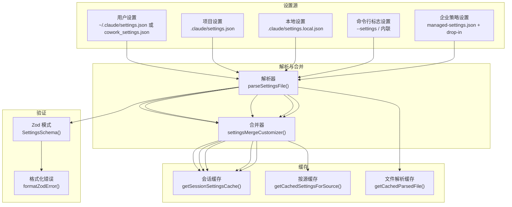
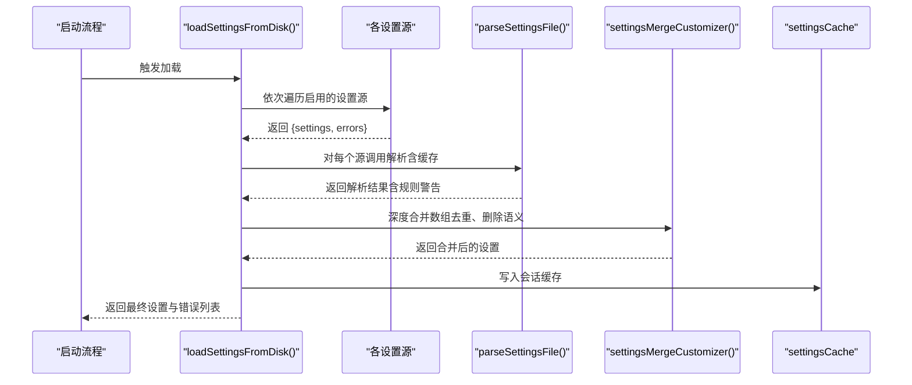
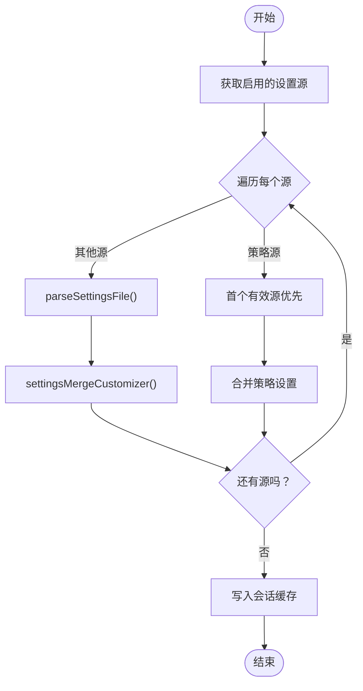
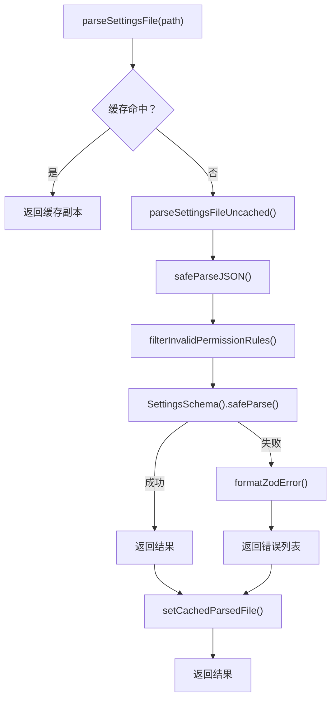
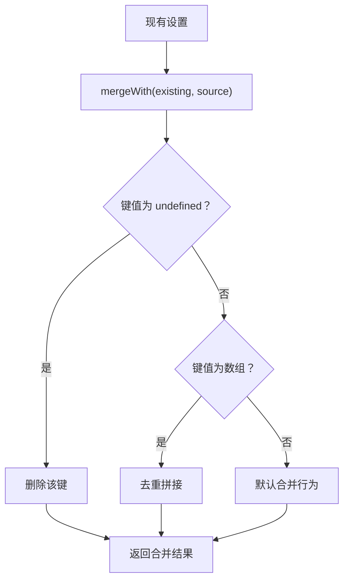
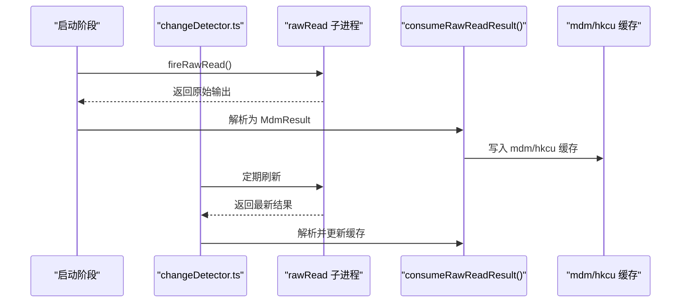
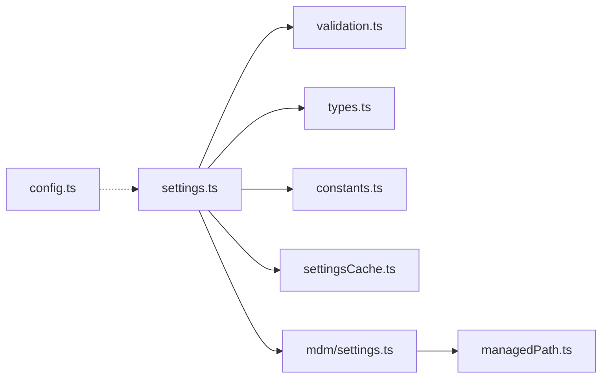

# 配置架构设计

<cite>
**本文档引用的文件**
- [settings.ts](file://src/utils/settings/settings.ts)
- [settingsCache.ts](file://src/utils/settings/settingsCache.ts)
- [types.ts](file://src/utils/settings/types.ts)
- [validation.ts](file://src/utils/settings/validation.ts)
- [constants.ts](file://src/utils/settings/constants.ts)
- [managedPath.ts](file://src/utils/settings/managedPath.ts)
- [mdm/settings.ts](file://src/utils/settings/mdm/settings.ts)
- [config.ts](file://src/utils/config.ts)
- [configConstants.ts](file://src/utils/configConstants.ts)
- [env.ts](file://src/utils/env.ts)
</cite>

## 目录
1. [引言](#引言)
2. [项目结构](#项目结构)
3. [核心组件](#核心组件)
4. [架构总览](#架构总览)
5. [详细组件分析](#详细组件分析)
6. [依赖关系分析](#依赖关系分析)
7. [性能考虑](#性能考虑)
8. [故障排除指南](#故障排除指南)
9. [结论](#结论)

## 引言
本文件系统性阐述 Claude Code 的配置架构设计，涵盖配置文件组织结构、配置项分类与层次关系、加载顺序与优先级规则、覆盖机制、验证体系（类型检查、默认值处理、错误恢复）、缓存与性能优化策略，并通过架构图与数据流图帮助开发者快速理解配置系统的内部工作原理。

## 项目结构
配置系统主要由以下模块构成：
- 设置解析与合并：负责从多源读取设置并进行深度合并，支持数组去重合并与删除语义。
- 验证与错误处理：基于 Zod 的强类型校验，提供可读的错误信息与提示。
- 缓存层：按会话、按源、按路径的多级缓存，避免重复 IO 与解析。
- 策略来源：用户、项目、本地、命令行标志、企业策略等多源叠加。
- 管理设置（MDM）：跨平台的企业策略读取与“首个有效源优先”策略。
- 全局配置：与设置分离的全局运行时配置（如主题、通知渠道、统计开关等）。

图表来源
- [settings.ts:178-231](file://src/utils/settings/settings.ts#L178-L231)
- [settings.ts:319-368](file://src/utils/settings/settings.ts#L319-L368)
- [settings.ts:538-547](file://src/utils/settings/settings.ts#L538-L547)
- [settingsCache.ts:7-59](file://src/utils/settings/settingsCache.ts#L7-L59)
- [types.ts:255-800](file://src/utils/settings/types.ts#L255-L800)
- [validation.ts:97-173](file://src/utils/settings/validation.ts#L97-L173)

章节来源
- [settings.ts:1-1016](file://src/utils/settings/settings.ts#L1-L1016)
- [settingsCache.ts:1-81](file://src/utils/settings/settingsCache.ts#L1-L81)
- [types.ts:1-1149](file://src/utils/settings/types.ts#L1-L1149)
- [validation.ts:1-266](file://src/utils/settings/validation.ts#L1-L266)
- [constants.ts:1-203](file://src/utils/settings/constants.ts#L1-L203)
- [managedPath.ts:1-35](file://src/utils/settings/managedPath.ts#L1-L35)
- [mdm/settings.ts:1-317](file://src/utils/settings/mdm/settings.ts#L1-L317)
- [config.ts:1-1818](file://src/utils/config.ts#L1-L1818)
- [configConstants.ts:1-22](file://src/utils/configConstants.ts#L1-L22)
- [env.ts:1-348](file://src/utils/env.ts#L1-L348)

## 核心组件
- 设置源与优先级
  - 用户设置（用户级）
  - 项目设置（共享目录级）
  - 本地设置（项目级且被 gitignore）
  - 命令行标志设置（内联或文件）
  - 企业策略设置（远程/MDM/文件/注册表）
  - 启动时总是启用策略与标志源；其他源受允许列表控制
- 解析与合并
  - 使用 Zod 对每个源进行严格模式校验
  - 数组采用去重合并；显式 `undefined` 视为删除键
  - 支持“首个有效源优先”的策略源策略
- 缓存
  - 会话级缓存：一次性合并结果缓存
  - 源级缓存：单个源解析结果缓存
  - 文件解析缓存：同一路径的解析结果缓存
- 验证
  - 统一的错误格式化与修复建议
  - 权限规则的容错过滤，避免整份设置失效
- 管理设置（MDM）
  - 跨平台读取：macOS plist、Windows HKLM/HKCU、Linux 文件
  - “首个有效源优先”，优先级：远程 > 系统策略 > 文件 > 用户策略
- 全局配置
  - 与设置分离的运行时配置（主题、通知、统计开关等），包含默认值工厂与键白名单

章节来源
- [constants.ts:7-22](file://src/utils/settings/constants.ts#L7-L22)
- [constants.ts:159-167](file://src/utils/settings/constants.ts#L159-L167)
- [settings.ts:645-796](file://src/utils/settings/settings.ts#L645-L796)
- [settings.ts:538-547](file://src/utils/settings/settings.ts#L538-L547)
- [settingsCache.ts:55-59](file://src/utils/settings/settingsCache.ts#L55-L59)
- [mdm/settings.ts:114-134](file://src/utils/settings/mdm/settings.ts#L114-L134)
- [config.ts:585-625](file://src/utils/config.ts#L585-L625)
- [config.ts:627-666](file://src/utils/config.ts#L627-L666)

## 架构总览
配置系统采用“多源解析 + 分层合并 + 强类型验证 + 多级缓存”的架构，确保在复杂的企业与个人场景下仍具备高可靠性与高性能。

图表来源
- [settings.ts:645-796](file://src/utils/settings/settings.ts#L645-L796)
- [settings.ts:178-231](file://src/utils/settings/settings.ts#L178-L231)
- [settings.ts:538-547](file://src/utils/settings/settings.ts#L538-L547)
- [settingsCache.ts:7-59](file://src/utils/settings/settingsCache.ts#L7-L59)

## 详细组件分析

### 设置源与加载顺序
- 源定义与显示名称
  - 定义了完整的设置源枚举与显示名称映射，便于 UI 与日志展示
- 启用控制
  - 通过引导状态获取允许的设置源集合，并强制包含策略与标志源
- 加载顺序
  - 以“插件基础层”为最低优先级，随后按启用顺序依次加载
  - 策略源采用“首个有效源优先”策略，其余源逐个合并

图表来源
- [constants.ts:159-167](file://src/utils/settings/constants.ts#L159-L167)
- [settings.ts:645-796](file://src/utils/settings/settings.ts#L645-L796)
- [settings.ts:538-547](file://src/utils/settings/settings.ts#L538-L547)

章节来源
- [constants.ts:1-203](file://src/utils/settings/constants.ts#L1-L203)
- [settings.ts:645-796](file://src/utils/settings/settings.ts#L645-L796)

### 解析与验证
- 解析流程
  - 优先读取缓存；未命中则执行磁盘读取与 JSON 解析
  - 在 Zod 校验前对权限规则进行容错过滤，避免整份设置因个别规则失效
- 错误格式化
  - 将 Zod 错误转换为带路径、期望值、修复建议与文档链接的统一结构
- 类型安全
  - 使用懒加载模式构建 Schema，减少初始化开销
  - 保留未知字段以提升向后兼容性

图表来源
- [settings.ts:178-231](file://src/utils/settings/settings.ts#L178-L231)
- [validation.ts:97-173](file://src/utils/settings/validation.ts#L97-L173)
- [validation.ts:224-265](file://src/utils/settings/validation.ts#L224-L265)
- [settingsCache.ts:47-53](file://src/utils/settings/settingsCache.ts#L47-L53)

章节来源
- [settings.ts:178-231](file://src/utils/settings/settings.ts#L178-L231)
- [validation.ts:1-266](file://src/utils/settings/validation.ts#L1-L266)
- [types.ts:255-800](file://src/utils/settings/types.ts#L255-L800)

### 合并与覆盖机制
- 数组合并策略
  - 对数组进行去重拼接，保证策略与市场源等数组类字段的正确合并
- 删除语义
  - 显式传入 `undefined` 表示删除该键，避免误删
- 覆盖规则
  - 后到源覆盖先到源；策略源采用“首个有效源优先”，其余源逐次合并
- 插件基础层
  - 插件提供的允许字段作为基础层，用户/项目/本地/标志/策略在其之上覆盖

图表来源
- [settings.ts:473-495](file://src/utils/settings/settings.ts#L473-L495)
- [settings.ts:529-531](file://src/utils/settings/settings.ts#L529-L531)
- [settings.ts:538-547](file://src/utils/settings/settings.ts#L538-L547)

章节来源
- [settings.ts:416-524](file://src/utils/settings/settings.ts#L416-L524)

### 管理设置（MDM）与企业策略
- 跨平台读取
  - macOS：/Library/Managed Preferences/ 下的 plist
  - Windows：HKLM/HKCU 注册表（HKLM 优先）
  - Linux：/etc/claude-code/managed-settings.json 及 drop-in 目录
- 首个有效源优先
  - 远程 > 系统策略 > 文件 > 用户策略
- 启动期并行加载与缓存
  - 早期触发子进程读取，解析后写入缓存，后续读取直接命中

图表来源
- [mdm/settings.ts:67-98](file://src/utils/settings/mdm/settings.ts#L67-L98)
- [mdm/settings.ts:228-273](file://src/utils/settings/mdm/settings.ts#L228-L273)
- [managedPath.ts:8-25](file://src/utils/settings/managedPath.ts#L8-L25)

章节来源
- [mdm/settings.ts:1-317](file://src/utils/settings/mdm/settings.ts#L1-L317)
- [managedPath.ts:1-35](file://src/utils/settings/managedPath.ts#L1-L35)

### 全局配置与默认值
- 默认值工厂
  - 提供零拷贝的默认全局配置对象工厂，避免深拷贝成本
- 键白名单
  - 明确列出可持久化的全局配置键，便于审计与迁移
- 与设置分离
  - 全局配置不参与设置合并，独立管理（如主题、通知渠道、编辑器模式等）

章节来源
- [config.ts:585-625](file://src/utils/config.ts#L585-L625)
- [config.ts:627-666](file://src/utils/config.ts#L627-L666)
- [configConstants.ts:1-22](file://src/utils/configConstants.ts#L1-L22)

## 依赖关系分析
- 模块耦合
  - settings.ts 依赖 validation.ts、types.ts、constants.ts、settingsCache.ts、mdm/settings.ts
  - mdm/settings.ts 依赖 managedPath.ts、validation.ts、types.ts
  - config.ts 与 settings.ts 独立但互补，分别管理全局配置与用户设置
- 外部依赖
  - Zod 用于强类型校验
  - lodash-es 的 mergeWith 与 memoize 用于合并与缓存
  - 平台特定的子进程读取用于 MDM 数据

图表来源
- [settings.ts:1-1016](file://src/utils/settings/settings.ts#L1-L1016)
- [validation.ts:1-266](file://src/utils/settings/validation.ts#L1-L266)
- [types.ts:1-1149](file://src/utils/settings/types.ts#L1-L1149)
- [constants.ts:1-203](file://src/utils/settings/constants.ts#L1-L203)
- [settingsCache.ts:1-81](file://src/utils/settings/settingsCache.ts#L1-L81)
- [mdm/settings.ts:1-317](file://src/utils/settings/mdm/settings.ts#L1-L317)
- [managedPath.ts:1-35](file://src/utils/settings/managedPath.ts#L1-L35)
- [config.ts:1-1818](file://src/utils/config.ts#L1-L1818)

章节来源
- [settings.ts:1-1016](file://src/utils/settings/settings.ts#L1-L1016)
- [mdm/settings.ts:1-317](file://src/utils/settings/mdm/settings.ts#L1-L317)

## 性能考虑
- 缓存策略
  - 会话级缓存：一次性合并结果缓存，避免重复计算
  - 源级缓存：单个源解析结果缓存，跨调用复用
  - 文件解析缓存：同一路径的解析结果缓存，避免重复 IO
- 启动期预热
  - MDM 子进程读取在启动早期触发，与模块加载并行
- 懒加载模式
  - Schema 使用懒加载，仅在首次使用时构建，降低冷启动成本
- 数组合并优化
  - 去重合并减少冗余条目，降低运行时处理成本

章节来源
- [settingsCache.ts:1-81](file://src/utils/settings/settingsCache.ts#L1-L81)
- [mdm/settings.ts:67-98](file://src/utils/settings/mdm/settings.ts#L67-L98)
- [types.ts:255-800](file://src/utils/settings/types.ts#L255-L800)

## 故障排除指南
- JSON 语法错误
  - 若文件存在语法错误，系统会记录错误并返回空设置；必要时回退到原始内容
- 权限规则无效
  - 对权限规则进行容错过滤，跳过无效条目并发出警告，避免整份设置失效
- 验证错误定位
  - 使用统一的错误格式化函数，提供字段路径、期望值、实际值与修复建议
- MDM 读取失败
  - 子进程读取失败或无内容时，系统会降级到下一个可用源（如文件或 HKCU）

章节来源
- [settings.ts:442-471](file://src/utils/settings/settings.ts#L442-L471)
- [validation.ts:224-265](file://src/utils/settings/validation.ts#L224-L265)
- [validation.ts:97-173](file://src/utils/settings/validation.ts#L97-L173)
- [mdm/settings.ts:228-273](file://src/utils/settings/mdm/settings.ts#L228-L273)

## 结论
Claude Code 的配置架构通过“多源解析 + 分层合并 + 强类型验证 + 多级缓存”的设计，在保证企业级策略可控的同时，兼顾了个人与团队场景下的灵活性与性能。其清晰的优先级规则、健壮的错误恢复与完善的缓存策略，使得配置系统在复杂环境中依然保持稳定与高效。