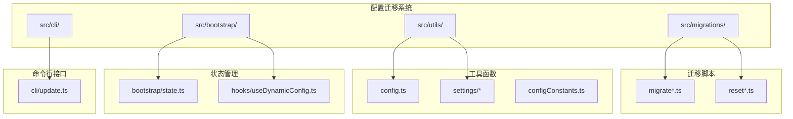
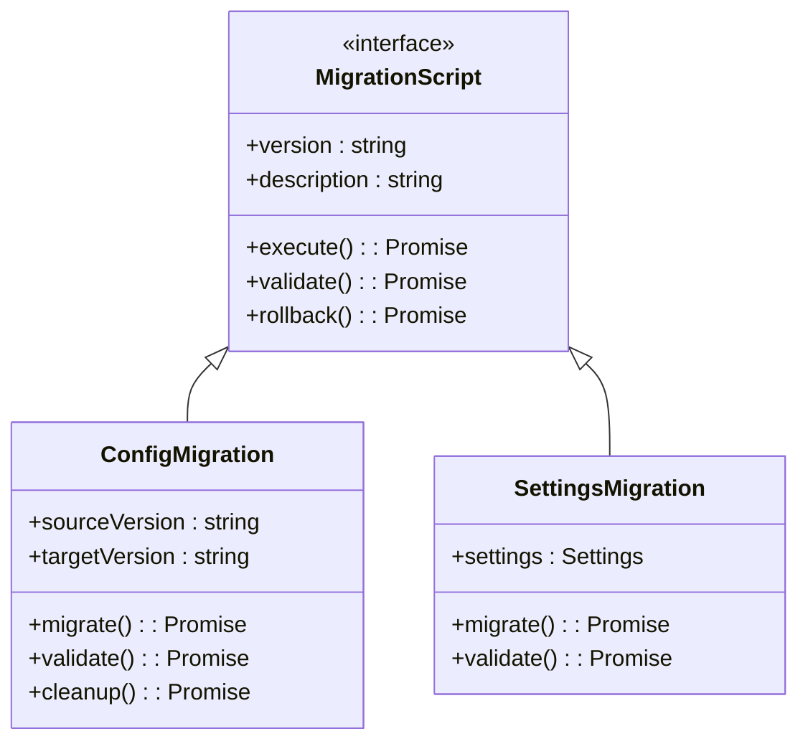
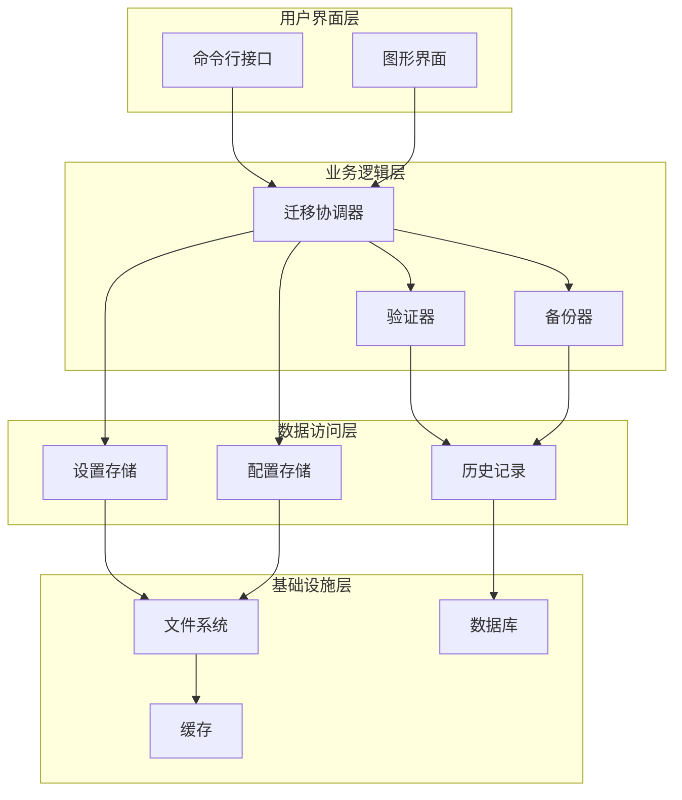
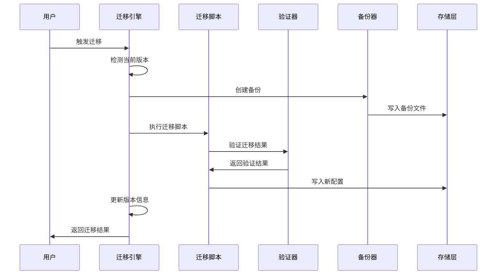
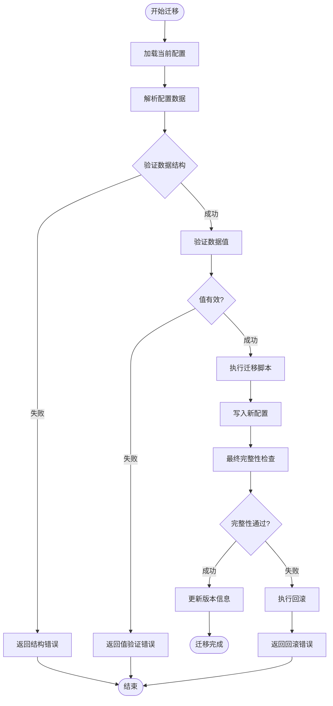
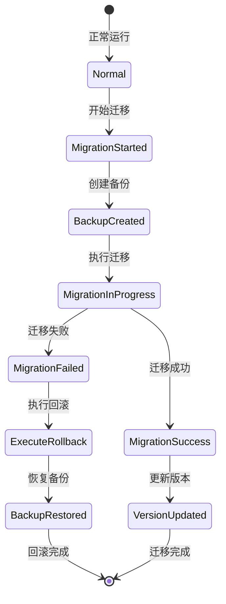
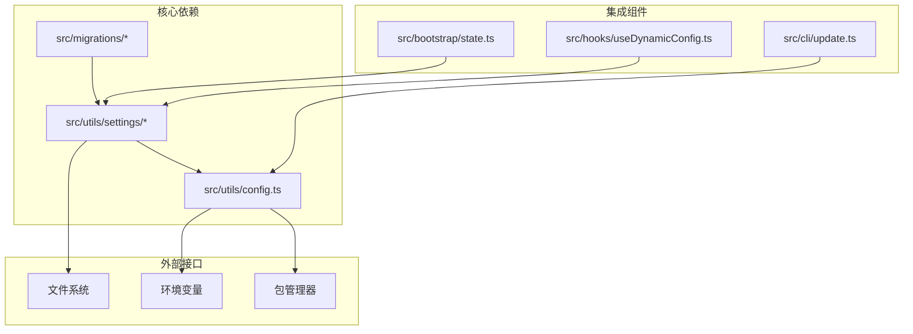
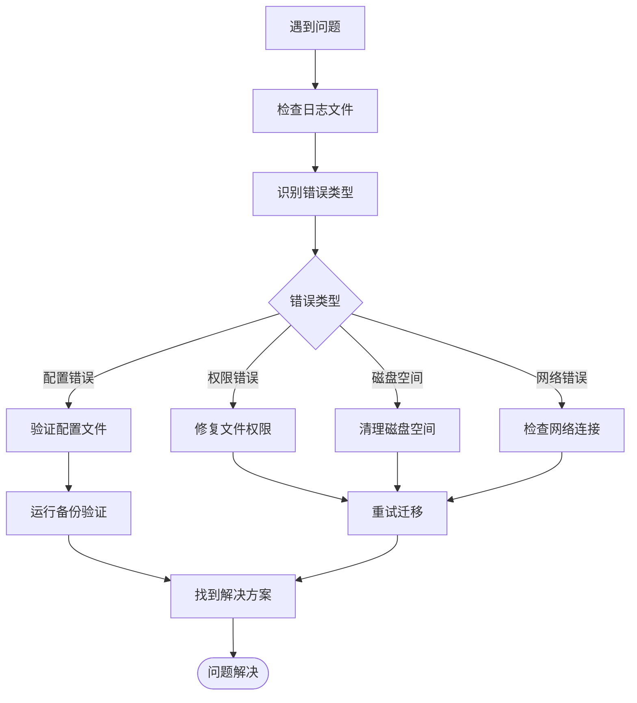

# 配置迁移系统

<cite>
**本文档引用的文件**
- [src/migrations/migrateAutoUpdatesToSettings.ts](file://src/migrations/migrateAutoUpdatesToSettings.ts)
- [src/migrations/migrateBypassPermissionsAcceptedToSettings.ts](file://src/migrations/migrateBypassPermissionsAcceptedToSettings.ts)
- [src/migrations/migrateEnableAllProjectMcpServersToSettings.ts](file://src/migrations/migrateEnableAllProjectMcpServersToSettings.ts)
- [src/migrations/migrateFennecToOpus.ts](file://src/migrations/migrateFennecToOpus.ts)
- [src/migrations/migrateLegacyOpusToCurrent.ts](file://src/migrations/migrateLegacyOpusToCurrent.ts)
- [src/migrations/migrateOpusToOpus1m.ts](file://src/migrations/migrateOpusToOpus1m.ts)
- [src/migrations/migrateReplBridgeEnabledToRemoteControlAtStartup.ts](file://src/migrations/migrateReplBridgeEnabledToRemoteControlAtStartup.ts)
- [src/migrations/migrateSonnet1mToSonnet45.ts](file://src/migrations/migrateSonnet1mToSonnet45.ts)
- [src/migrations/migrateSonnet45ToSonnet46.ts](file://src/migrations/migrateSonnet45ToSonnet46.ts)
- [src/migrations/resetAutoModeOptInForDefaultOffer.ts](file://src/migrations/resetAutoModeOptInForDefaultOffer.ts)
- [src/migrations/resetProToOpusDefault.ts](file://src/migrations/resetProToOpusDefault.ts)
- [src/utils/config.ts](file://src/utils/config.ts)
- [src/utils/configConstants.ts](file://src/utils/configConstants.ts)
- [src/bootstrap/state.ts](file://src/bootstrap/state.ts)
- [src/hooks/useDynamicConfig.ts](file://src/hooks/useDynamicConfig.ts)
- [src/cli/update.ts](file://src/cli/update.ts)
- [src/utils/settings/index.ts](file://src/utils/settings/index.ts)
- [src/utils/settings/loadSettingsDir.ts](file://src/utils/settings/loadSettingsDir.ts)
- [src/utils/settings/saveSettings.ts](file://src/utils/settings/saveSettings.ts)
- [src/utils/settings/types.ts](file://src/utils/settings/types.ts)
- [src/utils/settings/validateSettings.ts](file://src/utils/settings/validateSettings.ts)
- [src/utils/settings/migrateSettings.ts](file://src/utils/settings/migrateSettings.ts)
- [src/utils/settings/getSettingsVersion.ts](file://src/utils/settings/getSettingsVersion.ts)
- [src/utils/settings/setSettingsVersion.ts](file://src/utils/settings/setSettingsVersion.ts)
- [src/utils/settings/checkSettingsIntegrity.ts](file://src/utils/settings/checkSettingsIntegrity.ts)
- [src/utils/settings/backupSettings.ts](file://src/utils/settings/backupSettings.ts)
- [src/utils/settings/restoreSettings.ts](file://src/utils/settings/restoreSettings.ts)
- [src/utils/settings/rollbackSettings.ts](file://src/utils/settings/rollbackSettings.ts)
- [src/utils/settings/testSettingsMigration.ts](file://src/utils/settings/testSettingsMigration.ts)
</cite>

## 目录
1. [引言](#引言)
2. [项目结构](#项目结构)
3. [核心组件](#核心组件)
4. [架构概览](#架构概览)
5. [详细组件分析](#详细组件分析)
6. [依赖关系分析](#依赖关系分析)
7. [性能考虑](#性能考虑)
8. [故障排除指南](#故障排除指南)
9. [结论](#结论)
10. [附录](#附录)

## 引言

配置迁移系统是 Claude Code 平台的核心基础设施，负责在不同版本间安全地迁移用户配置和设置。该系统确保了向后兼容性，处理破坏性变更，并提供了完整的回滚机制。

系统采用模块化设计，通过预定义的迁移脚本和智能版本检测机制，实现了无缝的配置升级体验。每个迁移脚本都是独立的功能单元，专注于特定的配置变更场景。

## 项目结构

配置迁移系统主要分布在以下目录中：

**图表来源**
- [src/migrations/migrateAutoUpdatesToSettings.ts](file://src/migrations/migrateAutoUpdatesToSettings.ts)
- [src/utils/config.ts](file://src/utils/config.ts)
- [src/bootstrap/state.ts](file://src/bootstrap/state.ts)

**章节来源**
- [src/migrations/](file://src/migrations/)
- [src/utils/](file://src/utils/)
- [src/bootstrap/](file://src/bootstrap/)

## 核心组件

### 迁移脚本框架

系统采用标准化的迁移脚本框架，所有迁移脚本都遵循统一的接口规范：

**图表来源**
- [src/migrations/migrateAutoUpdatesToSettings.ts](file://src/migrations/migrateAutoUpdatesToSettings.ts)
- [src/utils/settings/migrateSettings.ts](file://src/utils/settings/migrateSettings.ts)

### 版本管理系统

系统实现了多层版本控制机制：

| 版本类型 | 存储位置 | 用途 | 更新时机 |
|---------|----------|------|----------|
| 应用版本 | package.json | 主要版本标识 | 发布时更新 |
| 设置版本 | settings.json | 配置格式版本 | 迁移完成后更新 |
| 迁移版本 | 迁移脚本 | 具体迁移规则 | 开发时添加 |
| 系统版本 | config.ts | 系统配置版本 | 初始化时设置 |

**章节来源**
- [src/utils/config.ts](file://src/utils/config.ts)
- [src/utils/configConstants.ts](file://src/utils/configConstants.ts)

## 架构概览

配置迁移系统采用分层架构设计，确保了高内聚低耦合的特性：

**图表来源**
- [src/utils/settings/migrateSettings.ts](file://src/utils/settings/migrateSettings.ts)
- [src/utils/settings/backupSettings.ts](file://src/utils/settings/backupSettings.ts)

## 详细组件分析

### 迁移脚本执行引擎

迁移脚本执行引擎是系统的核心组件，负责协调所有迁移操作：

**图表来源**
- [src/utils/settings/migrateSettings.ts](file://src/utils/settings/migrateSettings.ts)
- [src/utils/settings/backupSettings.ts](file://src/utils/settings/backupSettings.ts)

### 配置格式迁移机制

系统支持多种配置格式的自动转换：

| 迁移类型 | 源格式 | 目标格式 | 示例场景 |
|---------|--------|----------|----------|
| 模型名称变更 | fennec | opus | 从旧模型名迁移到新模型名 |
| 设置结构调整 | 对象属性 | 新对象结构 | 重新组织设置层次 |
| 功能开关迁移 | 布尔值 | 新枚举值 | 将简单开关转换为复杂配置 |
| 路径格式转换 | 相对路径 | 绝对路径 | 标准化文件路径格式 |

**章节来源**
- [src/migrations/migrateFennecToOpus.ts](file://src/migrations/migrateFennecToOpus.ts)
- [src/migrations/migrateLegacyOpusToCurrent.ts](file://src/migrations/migrateLegacyOpusToCurrent.ts)

### 数据验证与完整性检查

系统实现了多层次的数据验证机制：

**图表来源**
- [src/utils/settings/validateSettings.ts](file://src/utils/settings/validateSettings.ts)
- [src/utils/settings/checkSettingsIntegrity.ts](file://src/utils/settings/checkSettingsIntegrity.ts)

**章节来源**
- [src/utils/settings/validateSettings.ts](file://src/utils/settings/validateSettings.ts)
- [src/utils/settings/checkSettingsIntegrity.ts](file://src/utils/settings/checkSettingsIntegrity.ts)

### 回滚策略实现

系统提供了完整的回滚机制，确保迁移失败时能够恢复到原始状态：

**图表来源**
- [src/utils/settings/rollbackSettings.ts](file://src/utils/settings/rollbackSettings.ts)
- [src/utils/settings/restoreSettings.ts](file://src/utils/settings/restoreSettings.ts)

**章节来源**
- [src/utils/settings/rollbackSettings.ts](file://src/utils/settings/rollbackSettings.ts)
- [src/utils/settings/restoreSettings.ts](file://src/utils/settings/restoreSettings.ts)

## 依赖关系分析

配置迁移系统与其他组件的依赖关系如下：

**图表来源**
- [src/migrations/migrateAutoUpdatesToSettings.ts](file://src/migrations/migrateAutoUpdatesToSettings.ts)
- [src/utils/settings/index.ts](file://src/utils/settings/index.ts)
- [src/bootstrap/state.ts](file://src/bootstrap/state.ts)

**章节来源**
- [src/migrations/migrateAutoUpdatesToSettings.ts](file://src/migrations/migrateAutoUpdatesToSettings.ts)
- [src/utils/settings/index.ts](file://src/utils/settings/index.ts)
- [src/bootstrap/state.ts](file://src/bootstrap/state.ts)

## 性能考虑

配置迁移系统在设计时充分考虑了性能优化：

### 迁移性能优化策略

1. **增量迁移**: 只对需要变更的部分进行迁移，避免全量重写
2. **并行处理**: 支持多个独立迁移脚本的并行执行
3. **内存管理**: 使用流式处理减少内存占用
4. **缓存机制**: 缓存已验证的数据以提高重复迁移速度

### 内存使用优化

| 操作阶段 | 内存使用模式 | 优化策略 |
|---------|-------------|----------|
| 加载配置 | 全量加载 | 分块加载，延迟解析 |
| 验证数据 | 结构验证 | 流式验证，逐项检查 |
| 执行迁移 | 配置转换 | 原位修改，最小化复制 |
| 写入存储 | 文件输出 | 分块写入，异步I/O |

## 故障排除指南

### 常见迁移问题及解决方案

#### 迁移失败问题

**问题**: 迁移过程中出现异常中断
**原因**: 配置文件损坏或权限不足
**解决方案**: 
1. 检查配置文件完整性
2. 验证文件权限
3. 手动执行回滚操作

**问题**: 迁移后功能异常
**原因**: 验证失败但未正确回滚
**解决方案**:
1. 检查日志文件获取详细错误信息
2. 手动执行回滚到上一个稳定版本
3. 清理临时文件后重新尝试

#### 数据验证错误

**问题**: 配置验证失败
**原因**: 数据类型不匹配或值超出范围
**解决方案**:
1. 检查配置文件格式
2. 验证数据类型和范围
3. 使用默认值替换无效数据

**章节来源**
- [src/utils/settings/rollbackSettings.ts](file://src/utils/settings/rollbackSettings.ts)
- [src/utils/settings/restoreSettings.ts](file://src/utils/settings/restoreSettings.ts)

### 诊断工具使用

系统提供了多种诊断工具来帮助定位问题：

## 结论

配置迁移系统通过其模块化设计、完善的验证机制和可靠的回滚策略，为 Claude Code 平台提供了稳定可靠的配置管理能力。系统不仅支持平滑的版本升级，还能在出现问题时快速恢复到稳定状态。

未来的发展方向包括：
1. 增强自动化迁移能力
2. 提供更详细的迁移进度反馈
3. 支持更多格式的配置文件迁移
4. 优化大规模配置的迁移性能

## 附录

### 迁移脚本编写规范

#### 基本要求
- 每个迁移脚本必须包含版本信息和描述
- 必须提供完整的验证函数
- 需要实现回滚机制
- 应该处理边界情况和异常

#### 最佳实践
- 使用幂等性设计，确保重复执行的安全性
- 提供详细的错误处理和日志记录
- 测试覆盖所有可能的输入情况
- 保持脚本的简洁性和可维护性

### 迁移测试策略

#### 单元测试
- 测试每个迁移脚本的独立功能
- 验证输入输出的正确性
- 检查边界条件的处理

#### 集成测试
- 测试完整的迁移流程
- 验证回滚机制的有效性
- 检查与其他组件的兼容性

#### 性能测试
- 测试大规模配置的迁移性能
- 验证内存使用效率
- 检查并发处理能力