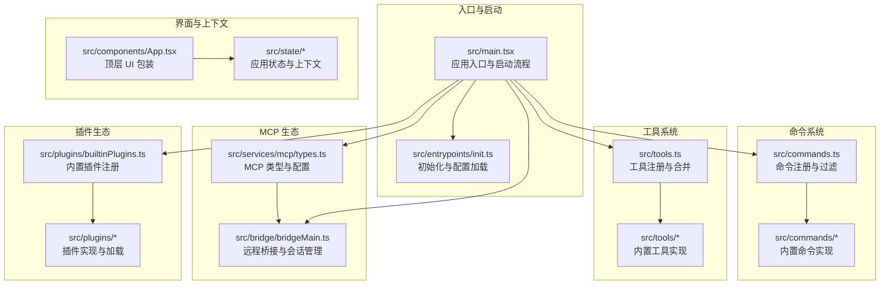
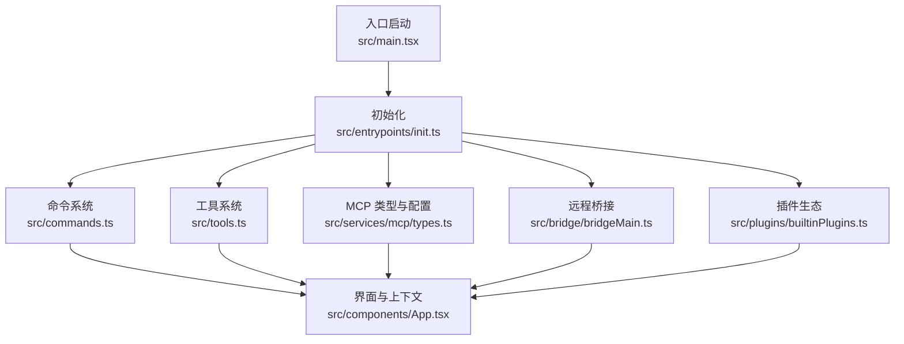
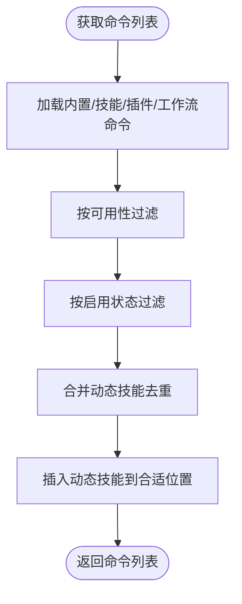
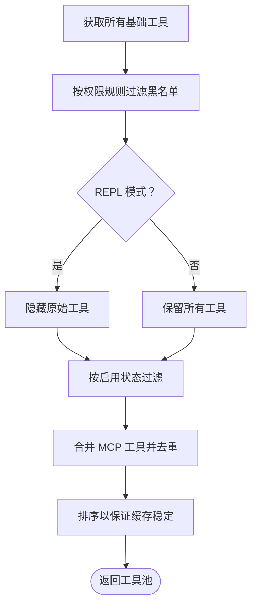
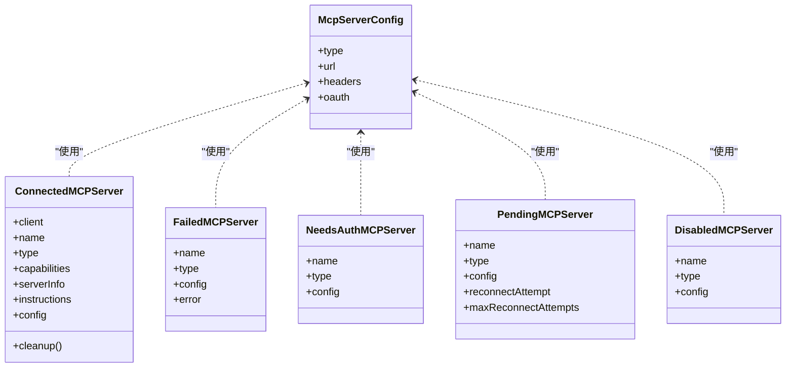
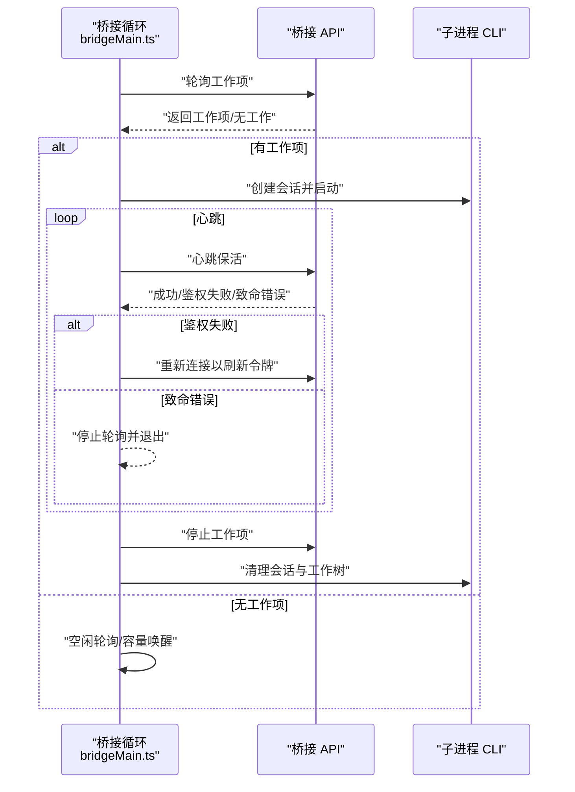
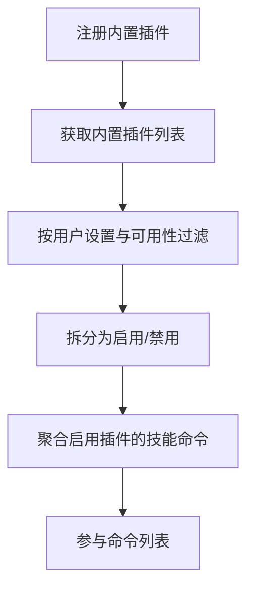
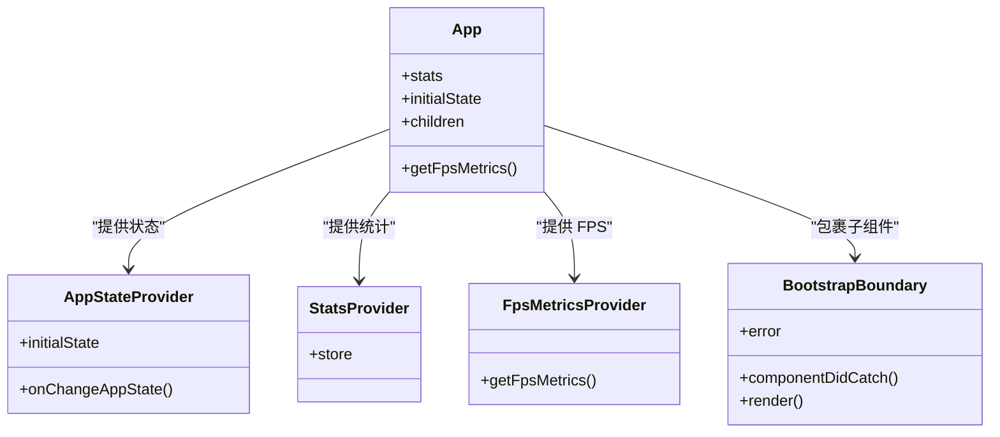
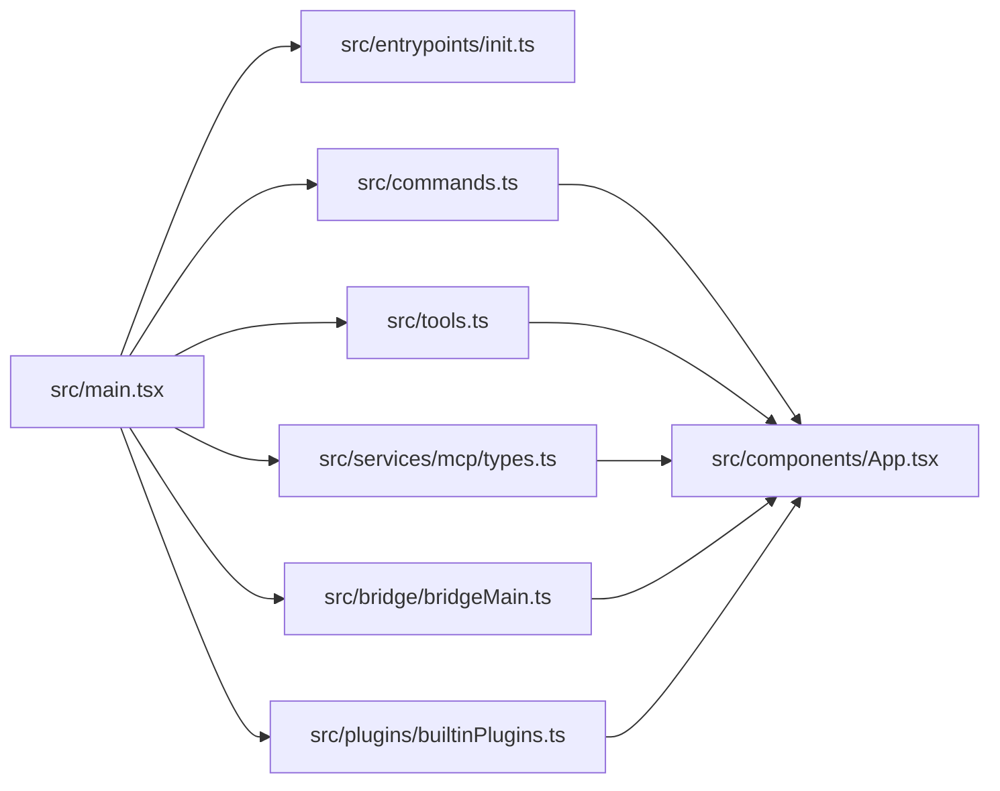

# 项目概述

<cite>
**本文档引用的文件**
- [package.json](file://package.json)
- [README.md](file://README.md)
- [src/main.tsx](file://src/main.tsx)
- [src/entrypoints/init.ts](file://src/entrypoints/init.ts)
- [src/services/mcp/types.ts](file://src/services/mcp/types.ts)
- [src/bridge/bridgeMain.ts](file://src/bridge/bridgeMain.ts)
- [src/plugins/builtinPlugins.ts](file://src/plugins/builtinPlugins.ts)
- [src/tools.ts](file://src/tools.ts)
- [src/commands.ts](file://src/commands.ts)
- [src/components/App.tsx](file://src/components/App.tsx)
</cite>

## 目录
1. [项目简介](#项目简介)
2. [项目结构](#项目结构)
3. [核心组件](#核心组件)
4. [架构总览](#架构总览)
5. [详细组件分析](#详细组件分析)
6. [依赖关系分析](#依赖关系分析)
7. [性能考量](#性能考量)
8. [故障排查指南](#故障排查指南)
9. [结论](#结论)

## 项目简介
Claude Code 是一个基于 TypeScript 与 React 的桌面 AI 代码助手应用，采用 React + Ink 构建终端图形界面，提供命令行与图形界面双入口，并以 AI 驱动的方式辅助开发者编写、审查与管理代码。项目通过 MCP（Model Context Protocol）协议实现与外部 AI 服务及工具的标准化连接，支持远程协作、插件生态与动态工具加载，帮助开发者在复杂工程中提升编码效率与一致性。

- **目标用户**：开发者、工程师团队、需要在终端与桌面环境中高效协作的 AI 辅助场景使用者
- **核心价值主张**：
  - 统一的命令行与图形界面入口，兼顾效率与易用性
  - 基于 MCP 的远程协作与插件扩展能力
  - 动态工具与技能系统，按需加载并优化上下文
  - 安全可控的权限与沙箱策略，保障本地执行安全
- **主要功能特性**：
  - 命令系统：内置 80+ 斜杠命令，支持插件与技能扩展
  - 工具系统：50+ 内置工具，支持 Bash、文件编辑、网络检索、任务管理等
  - MCP 生态：支持多种传输协议（STDIO/HTTP/WS/SSE/SDK），统一资源与工具发现
  - 远程控制桥接：通过 WebSocket 与 claude.ai 建立实时通道，实现远程操控与状态同步
  - 插件生态：内置插件注册与启用机制，支持用户级插件管理
  - 可观测性与遥测：延迟初始化遥测、指标与日志收集，支持远程门控与 A/B 实验

**章节来源**
- [README.md:1-361](file://README.md#L1-L361)
- [package.json:1-102](file://package.json#L1-L102)

## 项目结构
项目采用模块化组织，围绕“命令系统、工具系统、MCP 生态、远程桥接、插件生态”五大领域划分目录，配合 React + Ink 构建终端 UI，入口文件负责初始化与启动流程。

**图表来源**
- [src/main.tsx:585-800](file://src/main.tsx#L585-L800)
- [src/entrypoints/init.ts:57-238](file://src/entrypoints/init.ts#L57-L238)
- [src/commands.ts:258-517](file://src/commands.ts#L258-L517)
- [src/tools.ts:193-390](file://src/tools.ts#L193-L390)
- [src/services/mcp/types.ts:1-259](file://src/services/mcp/types.ts#L1-L259)
- [src/bridge/bridgeMain.ts:141-800](file://src/bridge/bridgeMain.ts#L141-L800)
- [src/plugins/builtinPlugins.ts:21-160](file://src/plugins/builtinPlugins.ts#L21-L160)
- [src/components/App.tsx:50-97](file://src/components/App.tsx#L50-L97)

**章节来源**
- [src/main.tsx:585-800](file://src/main.tsx#L585-L800)
- [src/entrypoints/init.ts:57-238](file://src/entrypoints/init.ts#L57-L238)
- [src/commands.ts:258-517](file://src/commands.ts#L258-L517)
- [src/tools.ts:193-390](file://src/tools.ts#L193-L390)
- [src/services/mcp/types.ts:1-259](file://src/services/mcp/types.ts#L1-L259)
- [src/bridge/bridgeMain.ts:141-800](file://src/bridge/bridgeMain.ts#L141-L800)
- [src/plugins/builtinPlugins.ts:21-160](file://src/plugins/builtinPlugins.ts#L21-L160)
- [src/components/App.tsx:50-97](file://src/components/App.tsx#L50-L97)

## 核心组件
- **应用入口与启动流程**：负责解析参数、建立信任、初始化配置、加载遥测、预取系统上下文与提示，随后渲染 REPL 并启动延迟预取。
- **命令系统**：集中注册与过滤命令，支持动态技能、插件与工作流命令，提供远程安全命令白名单与桥接安全命令判定。
- **工具系统**：统一内置工具与 MCP 工具的装配与去重，支持权限规则过滤与 REPL 模式下的工具屏蔽。
- **MCP 类型与配置**：定义服务器配置、传输类型、认证与 OAuth、资源与工具序列化等，支撑跨应用访问与 SDK 集成。
- **远程桥接**：通过 WebSocket 与 claude.ai 建立双向通道，管理会话生命周期、心跳与令牌刷新、容量唤醒与状态同步。
- **插件生态**：内置插件注册与启用，支持用户级插件管理与技能命令聚合。
- **界面与上下文**：顶层 UI 包装，提供 FPS 指标、统计与应用状态上下文，确保渲染稳定与可观测性。

**章节来源**
- [src/main.tsx:585-800](file://src/main.tsx#L585-L800)
- [src/commands.ts:258-517](file://src/commands.ts#L258-L517)
- [src/tools.ts:193-390](file://src/tools.ts#L193-L390)
- [src/services/mcp/types.ts:1-259](file://src/services/mcp/types.ts#L1-L259)
- [src/bridge/bridgeMain.ts:141-800](file://src/bridge/bridgeMain.ts#L141-L800)
- [src/plugins/builtinPlugins.ts:21-160](file://src/plugins/builtinPlugins.ts#L21-L160)
- [src/components/App.tsx:50-97](file://src/components/App.tsx#L50-L97)

## 架构总览
整体架构围绕“入口启动 → 命令与工具 → MCP 生态 → 远程桥接 → 插件生态 → 界面渲染”的链路展开，强调模块解耦、按需加载与安全可控。

**图表来源**
- [src/main.tsx:585-800](file://src/main.tsx#L585-L800)
- [src/entrypoints/init.ts:57-238](file://src/entrypoints/init.ts#L57-L238)
- [src/commands.ts:258-517](file://src/commands.ts#L258-L517)
- [src/tools.ts:193-390](file://src/tools.ts#L193-L390)
- [src/services/mcp/types.ts:1-259](file://src/services/mcp/types.ts#L1-L259)
- [src/bridge/bridgeMain.ts:141-800](file://src/bridge/bridgeMain.ts#L141-L800)
- [src/plugins/builtinPlugins.ts:21-160](file://src/plugins/builtinPlugins.ts#L21-L160)
- [src/components/App.tsx:50-97](file://src/components/App.tsx#L50-L97)

## 详细组件分析

### 命令系统分析
- **职责**：集中注册内置命令、动态技能、插件与工作流命令；提供可用性过滤、远程安全命令白名单与桥接安全命令判定。
- **关键点**：
  - 动态加载技能与插件命令，支持去重与插入到合适位置
  - 提供远程安全命令集合与桥接安全命令判定函数
  - 按可用性要求过滤命令（如 Claude.ai 订阅者、控制台 API 用户等）

**图表来源**
- [src/commands.ts:449-517](file://src/commands.ts#L449-L517)
- [src/commands.ts:619-686](file://src/commands.ts#L619-L686)
- [src/commands.ts:672-676](file://src/commands.ts#L672-L676)

**章节来源**
- [src/commands.ts:258-517](file://src/commands.ts#L258-L517)
- [src/commands.ts:619-686](file://src/commands.ts#L619-L686)
- [src/commands.ts:672-676](file://src/commands.ts#L672-L676)

### 工具系统分析
- **职责**：统一内置工具与 MCP 工具的装配与去重，支持权限规则过滤与 REPL 模式下的工具屏蔽。
- **关键点**：
  - 条件导入与死代码消除，按功能开关与用户类型裁剪工具集
  - 合并内置与 MCP 工具，保持提示缓存稳定性
  - 过滤黑名单工具，确保权限安全

**图表来源**
- [src/tools.ts:193-390](file://src/tools.ts#L193-L390)
- [src/tools.ts:345-367](file://src/tools.ts#L345-L367)

**章节来源**
- [src/tools.ts:193-390](file://src/tools.ts#L193-L390)
- [src/tools.ts:345-367](file://src/tools.ts#L345-L367)

### MCP 类型与配置分析
- **职责**：定义 MCP 服务器配置、传输类型、认证与 OAuth、资源与工具序列化等，支撑跨应用访问与 SDK 集成。
- **关键点**：
  - 支持 STDIO/HTTP/WS/SSE/SDK 等多种传输
  - 统一服务器配置与连接状态类型
  - 支持 OAuth 与跨应用访问（XAA）

**图表来源**
- [src/services/mcp/types.ts:124-259](file://src/services/mcp/types.ts#L124-L259)

**章节来源**
- [src/services/mcp/types.ts:1-259](file://src/services/mcp/types.ts#L1-L259)

### 远程桥接分析
- **职责**：通过 WebSocket 与 claude.ai 建立双向通道，管理会话生命周期、心跳与令牌刷新、容量唤醒与状态同步。
- **关键点**：
  - 会话管理：创建、心跳、令牌刷新、超时处理、清理
  - 容量控制：多会话模式下的容量唤醒与空闲轮询
  - 错误恢复：鉴权失败与致命错误的处理策略

**图表来源**
- [src/bridge/bridgeMain.ts:600-800](file://src/bridge/bridgeMain.ts#L600-L800)

**章节来源**
- [src/bridge/bridgeMain.ts:141-800](file://src/bridge/bridgeMain.ts#L141-L800)

### 插件生态分析
- **职责**：内置插件注册与启用，支持用户级插件管理与技能命令聚合。
- **关键点**：
  - 内置插件以 `@builtin` 标识，支持启用/禁用与多组件（技能、钩子、MCP 服务器）
  - 技能命令从启用的内置插件中聚合，参与命令列表

**图表来源**
- [src/plugins/builtinPlugins.ts:21-160](file://src/plugins/builtinPlugins.ts#L21-L160)

**章节来源**
- [src/plugins/builtinPlugins.ts:21-160](file://src/plugins/builtinPlugins.ts#L21-L160)

### 界面与上下文分析
- **职责**：顶层 UI 包装，提供 FPS 指标、统计与应用状态上下文，确保渲染稳定与可观测性。
- **关键点**：
  - 提供 FPS 指标与统计上下文
  - 应用状态提供与变更回调
  - 引导边界错误捕获与降级显示

**图表来源**
- [src/components/App.tsx:50-97](file://src/components/App.tsx#L50-L97)

**章节来源**
- [src/components/App.tsx:50-97](file://src/components/App.tsx#L50-L97)

## 依赖关系分析
- **入口与初始化**：入口文件依赖初始化模块完成配置、网络与遥测的早期准备，再进入命令与工具装配阶段。
- **命令与工具**：命令系统与工具系统相互独立但共同服务于会话执行，二者均依赖权限与策略过滤。
- **MCP 与桥接**：MCP 类型定义为桥接与远程控制提供统一的服务器抽象，桥接模块消费 MCP 配置与工具。
- **插件生态**：内置插件与命令/工具装配集成，形成可扩展的能力矩阵。
- **界面与上下文**：顶层包装器为整个应用提供统一的状态与上下文，贯穿渲染生命周期。

**图表来源**
- [src/main.tsx:585-800](file://src/main.tsx#L585-L800)
- [src/entrypoints/init.ts:57-238](file://src/entrypoints/init.ts#L57-L238)
- [src/commands.ts:258-517](file://src/commands.ts#L258-L517)
- [src/tools.ts:193-390](file://src/tools.ts#L193-L390)
- [src/services/mcp/types.ts:1-259](file://src/services/mcp/types.ts#L1-L259)
- [src/bridge/bridgeMain.ts:141-800](file://src/bridge/bridgeMain.ts#L141-L800)
- [src/plugins/builtinPlugins.ts:21-160](file://src/plugins/builtinPlugins.ts#L21-L160)
- [src/components/App.tsx:50-97](file://src/components/App.tsx#L50-L97)

**章节来源**
- [src/main.tsx:585-800](file://src/main.tsx#L585-L800)
- [src/entrypoints/init.ts:57-238](file://src/entrypoints/init.ts#L57-L238)
- [src/commands.ts:258-517](file://src/commands.ts#L258-L517)
- [src/tools.ts:193-390](file://src/tools.ts#L193-L390)
- [src/services/mcp/types.ts:1-259](file://src/services/mcp/types.ts#L1-L259)
- [src/bridge/bridgeMain.ts:141-800](file://src/bridge/bridgeMain.ts#L141-L800)
- [src/plugins/builtinPlugins.ts:21-160](file://src/plugins/builtinPlugins.ts#L21-L160)
- [src/components/App.tsx:50-97](file://src/components/App.tsx#L50-L97)

## 性能考量
- **延迟初始化**：遥测、网络代理、上游代理等在首次使用前延迟加载，减少启动开销。
- **预取与异步**：系统上下文、提示、模型能力等在安全条件下异步预取，避免阻塞首帧。
- **缓存与去重**：命令与工具列表采用记忆化缓存，动态技能与插件命令单独缓存，避免重复 I/O。
- **渲染优化**：顶层 UI 包装器提供 FPS 指标与统计上下文，便于定位渲染瓶颈。
- **背压与容量控制**：桥接模块在多会话模式下采用心跳与容量唤醒，避免过度轮询与资源争用。

[本节为通用指导，无需特定文件分析]

## 故障排查指南
- **配置错误**：初始化阶段若配置解析失败，将弹出无效配置对话框；在非交互模式下直接输出错误并优雅退出。
- **远程设置加载**：远程托管设置加载完成后，会重新应用环境变量并初始化遥测，若失败则记录调试日志。
- **桥接错误**：鉴权失败触发重新连接以刷新令牌；致命错误（如环境过期）停止轮询并退出；超时会标记为失败会话。
- **插件命令错误分类**：根据错误消息特征归类为网络、未找到、权限、校验或未知错误，便于快速定位问题类型。

**章节来源**
- [src/entrypoints/init.ts:215-238](file://src/entrypoints/init.ts#L215-L238)
- [src/entrypoints/init.ts:247-286](file://src/entrypoints/init.ts#L247-L286)
- [src/bridge/bridgeMain.ts:202-270](file://src/bridge/bridgeMain.ts#L202-L270)
- [src/utils/telemetry/pluginTelemetry.ts:238-259](file://src/utils/telemetry/pluginTelemetry.ts#L238-L259)

## 结论
Claude Code 通过命令系统、工具系统、MCP 生态、远程桥接与插件生态的协同，构建了一个可扩展、可远程协作且安全可控的桌面 AI 代码助手。其技术架构强调模块解耦、按需加载与可观测性，既满足开发者在终端中的高效使用，也为团队协作与企业级部署提供了坚实基础。借助 MCP 协议与桥接能力，项目在 AI 代码辅助领域具备显著的扩展性与协作优势，能够持续提升开发者的编码效率与一致性。

[本节为总结性内容，无需特定文件分析]